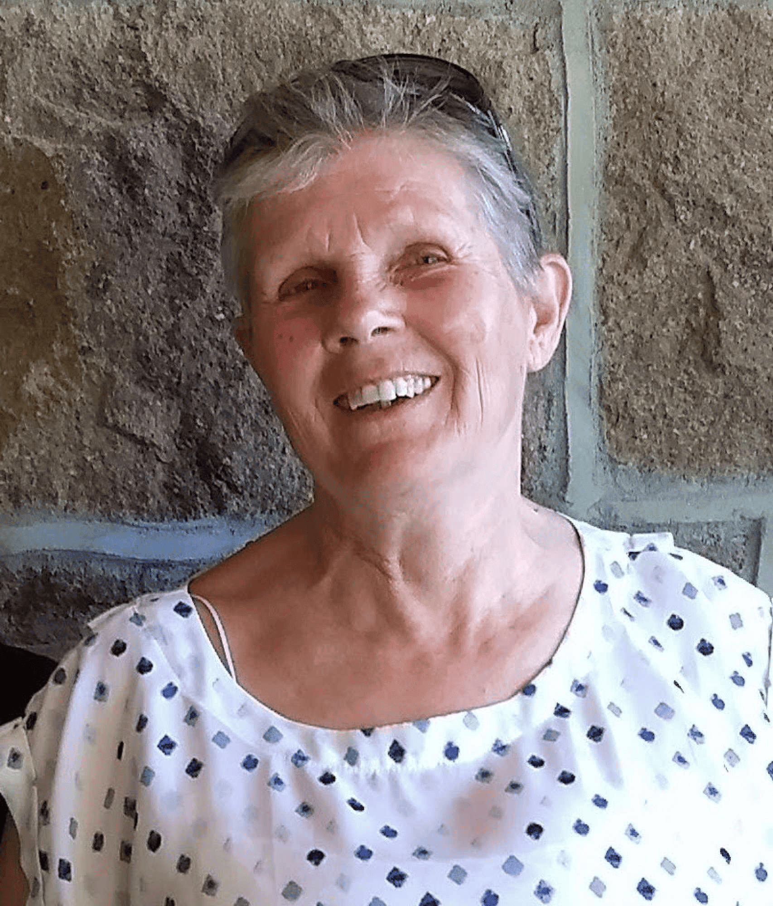

## Alumni Profile

# Pauline Hocking

-   Leaving Year: [1993](https://www.middleton.school.nz/tag/1993/)

“GO! Shackleton!! GO MIDDLETON!” Many reading this will remember my cheering on whoever was playing or swimming for those challenging, character building sixteen years I spent teaching at the school. It was heart breaking to leave the passion I felt for young people and the classroom behind, thinking I would never teach again.

However, God’s plans are not our plans. In 1993, Tony and I set out on an adventure that was intended to last two to five years but in reality lasted twenty five years. We had been called to be missionaries with Wycliffe Bible Translators in a creative access country in North Africa. Our role was to train the local believers, of whom there were twenty among ten million at the time, in the principles of Bible Translation – teaching, enabling, facilitating, encouraging. After twelve years serving with Wycliffe, we transferred to Operation Mobilisation for the following thirteen years, doing much the same work – orientating people to our environment, helping with language learning etc.

We also received and trained newly arrived missionaries, helping them to thrive rather than merely survive. Language learning, shopping, running their own homes, finding appropriate employment for applying for visas. Any one of us could have been refused our visas at any moment and forced to leave.

Our own visa was a gift from the Lord – I, with an Irish passport, was asked to teach French in the American School in our North African city. What a blessing to be back working with young people, a role that lasted eighteen years and which provided a visa for both me and my husband.

Before returning to New Zealand, we served for two years at the Operation Mobilisation office in Ireland by way of transition from an Arab land to our own Kiwi culture.

And guess what – I am still involved with Middleton as a reliever, often meeting up with the children of those whom I taught “back in the day”! 😊 It gives me such pleasure having the opportunity to continue to encourage young people to become the people they are made to be and do the things God has for them to do.

The verses that spur us on:

Romans 10:13-15: for, “Everyone who calls on the name of the Lord will be saved.” How, then, can they call on the one they have not believed in? And how can they believe in the one of whom they have not heard? And how can they hear without someone preaching to them? And how can anyone preach unless they are sent? As it is written: “How beautiful are the feet of those who bring good news!”

1 Corinthians 15:58: Therefore, my dear brothers and sisters, stand firm. Let nothing move you. Always give yourselves fully to the work of the Lord, because you know that your labor in the Lord is not in vain.

[Back to Alumni](https://www.middleton.school.nz/alumni/)

### More Alumni Profiles

### [Stephanie Hunt (née Mathieson)](https://www.middleton.school.nz/stephanie-hunt-nee-mathieson/)

### [Caleb Croker](https://www.middleton.school.nz/caleb-croker/)

### [Ellen Paynter](https://www.middleton.school.nz/ellen-paynter/)

### [Elisha Nuttall](https://www.middleton.school.nz/elisha-nuttall/)

### [Frances Watson](https://www.middleton.school.nz/frances-watson/)

### [Geoff Wallis (Primary Teacher, 2016–2022)](https://www.middleton.school.nz/geoff-wallis-primary-teacher-2016-2022/)

[See all](https://www.middleton.school.nz/alumni-profiles/)
