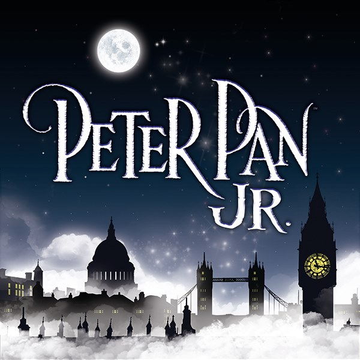

## News

# Peter Pan Jr

-   [September 6, 2019](https://www.middleton.school.nz/2019/09/06/)

Join us and witness the classic which never gets old!

Peter and his mischievous fairy sidekick, Tinkerbell, visit the nursery of the Darling children late one night and, with a sprinkle of pixie dust, begin a magical journey across the stars that none of them will ever forget. In the adventure of a lifetime, the travelers come face to face with a ticking crocodile, a fierce Indian tribe, a band of bungling pirates and, of course, the villainous Captain Hook.

Order Tickets here: [**middletongrange.eventbrite.com**](http://middletongrange.eventbrite.com/?fbclid=IwAR1zi5mL-T1r4iFjwCf771DKKojULRBKzi6jZJUkiCSgstzuMfgI23GzZ9s)

Show Dates are as follows:

Wednesday 20th November | 7.30pm (Sales Dependent)  
Thursday 21st November | 7.30pm  
Friday 22nd November | 7.30pm  
Saturday 23rd November | 2.00pm (Matinee)

#### Archives

Archives Select Month February 2026 April 2024 March 2024 September 2023 June 2023 May 2023 December 2022 October 2022 September 2022 July 2022 June 2022 April 2022 March 2022 February 2022 January 2022 December 2021 October 2021 August 2021 February 2021 January 2021 September 2020 August 2020 May 2020 April 2020 March 2020 February 2020 January 2020 November 2019 September 2019 August 2018 June 2018 May 2018 February 2018 December 2017 October 2017 September 2017 July 2017 June 2017 May 2017 April 2017 March 2017 February 2017 January 2017 December 2016 November 2016 October 2016 August 2016 July 2016 June 2016 May 2016 April 2016 March 2016 February 2016 December 2015 October 2015 September 2015 August 2015
