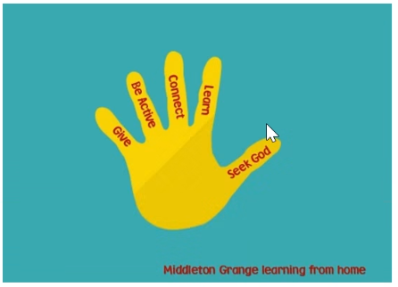

# Remote Learning

-   [Curriculum & Subjects](https://www.middleton.school.nz/curriculum-subjects/)
-   [Course Selection](https://www.middleton.school.nz/course-selection/)
-   [Careers Department](https://www.middleton.school.nz/careers-department/)
-   [Leadership](https://www.middleton.school.nz/leadership/)
-   [Service](https://www.middleton.school.nz/service/)
-   [Remote Learning](https://www.middleton.school.nz/remote-learning/)
-   [NCEA Information](https://www.middleton.school.nz/ncea-information/)
-   [Learning Support](https://www.middleton.school.nz/learning-support/)
-   [Fostering Strengths](https://www.middleton.school.nz/fostering-strengths/)
-   [Pastoral Care](https://www.middleton.school.nz/pastoral-care/)
-   [BYOD](https://www.middleton.school.nz/byod/)
-   [Library Dashboard](https://aiscloud.nz/MDD00/#!landingPage)
-   [Overseas Trips](https://www.middleton.school.nz/overseas-trips/)
-   [Sport](https://www.sporty.co.nz/middleton)
-   [Performing Arts](https://www.middleton.school.nz/performing-arts/)

### **Guidelines for Remote Learning for Parents**

“Show me your ways, Lord, teach me your paths.”  [**Psalm 25:4**](https://dailyverses.net/psalms/25/4)

Jesus answered, “My teaching is not my own. It comes from the one who sent me.”  [**John 7:16**](https://dailyverses.net/john/7/16) 

“The fear of the Lord is the beginning of knowledge, but fools despise wisdom and instruction.”     [**Proverbs 1:7**](https://dailyverses.net/proverbs/1/7) 

### **Rationale**

Our experience from 2020 has reinforced the many advantages of in class tuition. However, due to factors outside our control there may came a time again when it is necessary to engage in remote teaching. During such circumstances our philosophy (or rationale), is that we will be primarily focused upon Waiora (Well Being) and Health and Safety of all students who must engage in remote learning.  We acknowledge that teaching and learning maintains its importance and must continue. However, with remote teaching we must embrace a ‘Flexible’ approach to instruction, ensuring students experience a range of learning opportunities, as well as using a range of learning resources and media.  It is important during this time for students to carefully manage ‘On- Screen time’, as ‘too much’ screen time may be harmful to all our Waiora (Well Being).

### **Parent Guidelines**

The following guidelines are to help parents assist their children with the transformation to remote learning. They are naturally different depending upon the age of the student

###  **Year 1 – Year 6**

1.  Help your child to prepare a **workspace** at home (dining table, study, bedroom, etc) from which your child can complete their schoolwork
2.  Teachers will make contact with their classes on **Monday 23rd August** by email/HERO, Seesaw, Teams or Zoom, and will continue to provide guidance about ongoing home learning. Because younger students should not be spending large amounts of time on-line, and many families have limited access to devices, we will prepare work packs of learning activities to assist you all and will have these delivered to you.
3.  Our Learning Support Team will make contact with some English Language Learners and students who have been receiving learning support and will continue to offer this via Zoom. The ‘STEPS’ literacy programme is available on-line for those that have been using it.
4.  If your child is struggling to keep up with the work, please encourage them to let **their teacher know**
5.  Encourage your child to allocate time for themselves during the day **for prayer** and reading of the **bible**

### **Year 7 – Year 8**

The most important thing for our Year 7/8 students at this time is that they feel calm and connected. The lockdown will have impacted student’s thoughts and emotions in different ways. Routine and consistency can provide an opportunity for structure which helps reduce stress, worry and anxiety. Our remote learning plan allows for our students to connect with their teacher and classmates as well as provide them some structure to support their learning. It has a balance of opportunities to connect with others and complete work, within a structure that also provides some flexibility to support parents managing home learning.

**Your child will be encouraged to participate in our Daily High 5, Home learning:**

-   **Seek God** – time to pray or read God’s word, journal
-   **Learn** – work through various learning tasks set on OneNote or Teams
-   **Connect** – connect with family in your bubble, call a friend
-   **Be Active** – get outside and have some fresh air, do some indoor physical activity
-   **Give** – give of themselves by cleaning up from a meal, do some washing or household chores, make someone else’s bed

Our Year 7 and 8 students will access their work through their Homeroom Teams and OneNote. The students are familiar with these platforms. This can be found at www.mgs.nz – they then click on the waffle and click ‘Teams.’ Teachers will also communicate with your child via their school-based email address.

Initially, remote learning will include Maths, Literacy (Reading and Writing), Social Studies and Scripture and will be provided by your child’s Homeroom Teacher. The children will also be encouraged to use the websites we use to support our learning, Mathletics and Write That Essay. Work from other subjects (e.g Languages, PE, Technology etc) may be added dependent upon time spent in lockdown. Any requirements for these extra subjects will come via the Homeroom platform so that children don’t become confused with multiple access points. It is likely that a weekly Teams Lesson (in addition to the Homeroom Meetings) will be added for Mathematics and Science in the week beginning Monday 30th August if Lockdown continues beyond this time. We will communicate the times for these closer to the time if required.

On **Mondays before 10am**, an email will also be sent to your child’s school email account with the files and documents they need for the week. This is a direct copy of what is in the class OneNote.

Each Homeroom class will have a ‘Teams’ (not Zoom) meeting/call three mornings a week, Monday, Wednesday, and Friday. They will find the meeting link in their school emails and / or calendar on Teams. These meetings will be at:

Year 7:          **10:00-10:30am**

Year 8:          **9:30 – 10:00am**

The homeroom teachers will also be available during school hours to answer emails or catch up with individuals, as necessary. These will be the only face-to-face requirements during the week and students will be able to plan how they approach set tasks during the remainder of the time. As different families will have different accessibility / sharing of devices etc, teachers will not be penalizing students if some tasks are incomplete.

The work your child will be completing is essentially a continuation of the work they have been doing in class and follows our term plan. Content may be modified to make it suit remote learning. There will be a range of screen-based and non screen-based activities. For example, a task may be set via OneNote but may be completed on pen and paper etc.

If your child is struggling or finding it hard to access or complete learning while they are at home, please make sure you are in touch with your child’s teacher via email. We want to ensure that all our students have access to learning and feel comfortable during this time of home learning.

### **Year 9 – Year 13**

1.  Help your child to prepare a **workspace** at home (dining table, study, bedroom, etc) from which your child can complete their schoolwork
2.  Familiarize yourself with the **remote timetable** so you are aware when your child’s “**live**” classes will occur
3.  Encourage your child to prioritize the “**live**” contact **Teams Meeting** in the timetabled period slot, as indicated in the **remote timetable**. This will be the **same period** every week
4.  Encourage your child to check the weekly outline of **work** expectations in the “**Posts**” section in their class **Teams** on **Monday**
5.  Encourage your child to check their school **emails** i.e. at least once a day and reply as necessary.
6.  If your child is **struggling** to keep up with the work, please encourage them to let **their teacher know**
7.  **Teachers** will be **available** for queries during the **normal timetabled class period** (outside of the “**live**” contact sessions)
8.  Encourage your child to allocate time for themselves during the day **for prayer** and reading of the **bible**
