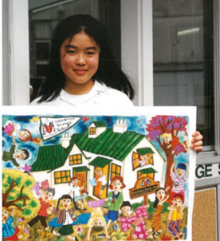

## Alumni Profile

# Renita Stuart (Sari)

-   Leaving Year: [2000](https://www.middleton.school.nz/tag/2000/)

Artist to the famous drawing hanging in the principal’s office since 1998. A few words from Renita:

I was 13 when I drew it, and I was in my first year at Middleton. I was a part of the ESOL program that Mrs Mary Logan ran. I studied at Middleton when I was 3rd form- end of 5th form (1998- 2000) then I finished my high school in Canada and continued my undergraduate at University of Toronto doing architecture and art history. If you look at the picture, the girl in the center with black hair was my self-portrait and next to it was Mrs Logan.

I have 5 children studying at Middleton now. Ranging from year 10 to year 3. We lived in Australia for a while after my husband Jeremy (whom I dated at MGS) and I got married, we were involved in youth ministry for several years.

We moved back to New Zealand in 2012. To continue my artistic flair, I had a photography business specialising in family portraits and weddings. I homeschooled a couple of children for a season, and now I am working full time when my children are at school.

[Back to Alumni](https://www.middleton.school.nz/alumni/)

### More Alumni Profiles

### [Stephanie Hunt (née Mathieson)](https://www.middleton.school.nz/stephanie-hunt-nee-mathieson/)

### [Caleb Croker](https://www.middleton.school.nz/caleb-croker/)

### [Ellen Paynter](https://www.middleton.school.nz/ellen-paynter/)

### [Elisha Nuttall](https://www.middleton.school.nz/elisha-nuttall/)

### [Frances Watson](https://www.middleton.school.nz/frances-watson/)

### [Geoff Wallis (Primary Teacher, 2016–2022)](https://www.middleton.school.nz/geoff-wallis-primary-teacher-2016-2022/)

[See all](https://www.middleton.school.nz/alumni-profiles/)
