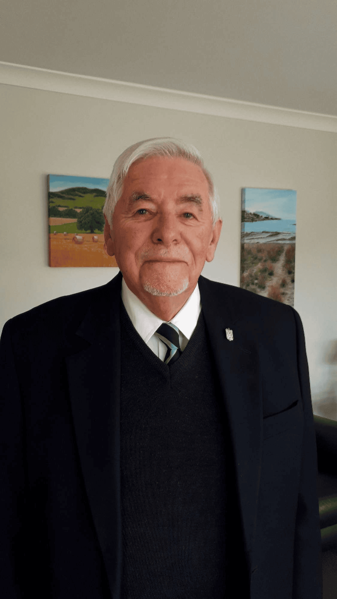

## Alumni Profile

# Russell Kent

-   Leaving Year: [1987](https://www.middleton.school.nz/tag/1987/)

I was appointed to the staff of Middleton Grange in 1971 as HOD of Music and taught there for 17 years. In those early days of the school (started 1964), it was usual for the secondary staff to also have responsibility for a form class and to teach other subjects at different levels as well. I was given a Form 2 (year 8) class as my own form class and was required to teach them English, Social Studies, Scripture, and of course, core Music. I also taught English and Social Studies to a Form 3 (year 9) class as well.

My own background had been in primary education, and I studied at the Christchurch Teachers Training College (as it was then) in 1960–61, completing a third year as a music specialist. I taught in several primary schools around Christchurch and was responsible for school and area music festivals in their districts before coming to MGS. At the same time, I trained as a choral conductor under Mr. Keith Newson and Mr. George Martin who also taught me the organ, completing an FTCL whilst teaching at MGS. In 1969, I retrained as a secondary teacher, attending night classes at the College of Education.

Those early years at MGS were great, as I was so fortunate to have some amazingly gifted students in the music department, several of whom I still keep in contact with today. It was a very busy time, as my wife Jan and I were raising a young family, and I was building a music department with choirs, orchestra, & chamber groups. I was also introducing senior courses at School Certificate and U.E level (Years 11-13) and getting our school involved in community and city-wide festivals and concerts. I was also an organist at Oxford Terrace Baptist Church (1966-2024) and Associate Musical Director of the Christchurch Schools’ Music Festival. Later on, I served as Musical Director, and I am now Patron of that organisation.

I give God thanks for the joy of having had the privilege of working with wonderful students and teachers at MGS. In the early 1970’s, Bill Moore (HOD Art) also had a Form 2 (year 8) class, and we would often combine classes and do field trips together over to the West Coast, North Canterbury, and Banks Peninsula. These were amazing, and many funny things happened on these trips. Just as well there were minimum (if any) health and safety requirements in those days!!

Another great joy was preparing students for the school productions. These were memorable times, as often several staff were involved either in the cast, production teams, or helping in the orchestra and choir. We produced some great shows, and I was always amazed and humbled with what the students were able to do, as you often perceived and appreciated them in a new way as they shone in their roles in these productions.

On leaving MGS in 1987, I worked as a Music Advisor for the Ministry of Education, with responsibility for music education in primary and secondary schools in Canterbury and Westland. This was really interesting and rewarding work, and I particularly enjoyed working with teachers and children in small, rural, sole charge, two or three teacher schools around the district. They really appreciated the help I was able to give, as many of these schools were very isolated. In 1990, I was awarded the NZ Commemoration medal for service to Music Education in NZ.

I thought I had retired from the Advisory Service in 1999 after 40 years in education, but I ended up teaching Music part-time at St. Andrew’s College to help out a colleague who had taken study leave initially for one term only. I taught there for another seven years!

During the whole period of my music career in education and beyond, I was very involved in Church music. I have recently retired from the role of Organist at Oxford Terrace Baptist Church (OTBC) after 58 years of service. I have also conducted choirs at both OTBC and Christchurch Cathedral. In these roles, I have sought to serve God and the community in aiming to uplift worship and enrich peoples’ faith experience through music.

I had no sudden conversion to the Christian faith but a lifelong continuous growth of the wonderful freedom that Christ brings to us all. This has been my aim in the way I do my work, treat people, and try to be aware that we are all children of God and what I do and say can either bring people to an awareness of the faith or turn them off completely.

I am now 84 and am still doing a little bit of organ teaching and playing, enjoying family times together, catching up with former pupils and colleagues, and enjoying being able to attend church and appreciate the music and teaching therein. I give thanks to God for my life and the wonderful people I have met along this journey. I have been greatly blessed.

[Back to Alumni](https://www.middleton.school.nz/alumni/)

### More Alumni Profiles

### [Stephanie Hunt (née Mathieson)](https://www.middleton.school.nz/stephanie-hunt-nee-mathieson/)

### [Caleb Croker](https://www.middleton.school.nz/caleb-croker/)

### [Ellen Paynter](https://www.middleton.school.nz/ellen-paynter/)

### [Elisha Nuttall](https://www.middleton.school.nz/elisha-nuttall/)

### [Frances Watson](https://www.middleton.school.nz/frances-watson/)

### [Geoff Wallis (Primary Teacher, 2016–2022)](https://www.middleton.school.nz/geoff-wallis-primary-teacher-2016-2022/)

[See all](https://www.middleton.school.nz/alumni-profiles/)
