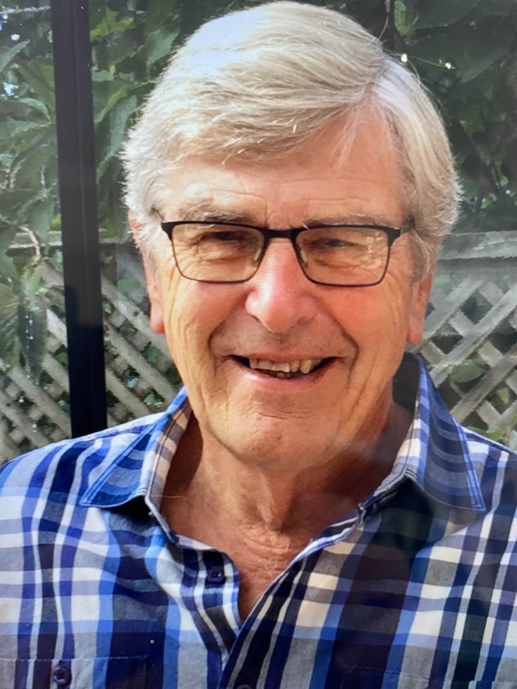

## Alumni Profile

# Russell Vaughan

-   Leaving Year: [2004](https://www.middleton.school.nz/tag/2004/)

Carol and I were in Stratford after returning from Suffolk where I had been teaching Geography and P.E./Sport for three years. Rector Eric Dunlop had always sent a circular to keep Scripture Union Crusader leaders up to date on this new Christian venture. Two weeks later, just as our third child was to be born, Eric asked me to fly down to be interviewed by the Board of Governors. I was “given a grilling” in the old Summerhill house where the Performing Arts Centre is today. I got the call and the job! Don Capill was taking on responsibilities as Deputy Rector, and I was to eventually take up the leadership of the Social Studies Department.

God had His hand on us as we settled into Redwood. Don Capill and other overseas speakers led us to discuss how schemes could be based on Biblical truths and values, and they became part of our Curriculum. I had wonderful staff like Pam Brathwaite and Jane Ellis in History, Peter Juriss in Classics, and Annie Kersley, Alison McMillan, and Samantha Gough-Jones in Geography. We had some challenging field trips as far as Craigieburn. Lyndon Hadden and I had to push large branches off the road so the old blue van could get up.

Sport was something to encourage our players. I was fortunate to have Ralph Webster, PE Department, to assist with tennis coaching, while I organized it for 31 years. The first XI boys’ hockey played so well one year that Graham, Batstone, Wyatt and Wells “kidnapped “me for a meal at an Avonhead restaurant. What camaraderie!

I retired in 2004. A reluctant pupil wrote in my autograph book, “Thanx for teaching me about Hitler and the War.” I was chuffed! After a couple of years away from MGS, I recovered enough to sit on the Board of Trustees, as Mark Larson needed a Middleton Trust member. Seeing MGS from the opposite side of the table was illuminating.

May God bless our alumni, as we have so many tales to tell as we see giftings being activated, compassion at home and abroad, and we can see light in His light!

Middleton Grange School teacher (1974 – 2004).

[Back to Alumni](https://www.middleton.school.nz/alumni/)

### More Alumni Profiles

### [Stephanie Hunt (née Mathieson)](https://www.middleton.school.nz/stephanie-hunt-nee-mathieson/)

### [Caleb Croker](https://www.middleton.school.nz/caleb-croker/)

### [Ellen Paynter](https://www.middleton.school.nz/ellen-paynter/)

### [Elisha Nuttall](https://www.middleton.school.nz/elisha-nuttall/)

### [Frances Watson](https://www.middleton.school.nz/frances-watson/)

### [Geoff Wallis (Primary Teacher, 2016–2022)](https://www.middleton.school.nz/geoff-wallis-primary-teacher-2016-2022/)

[See all](https://www.middleton.school.nz/alumni-profiles/)
