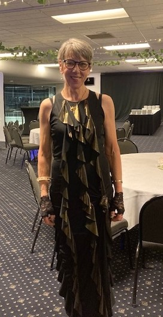

## Alumni Profile

# Ruth Velluppillai

-   Leaving Year: [2023](https://www.middleton.school.nz/tag/2023/)

Kia Ora! I am Ruth Velluppillai (née Wells). I have four grown children and 14 grandchildren, one sadly a still-birth, but the others aged 4 to 15 years. I was a pupil at Middleton Grange School from 1968-1974 (Form 1 until Form 7, with only 6 of us in that final year group!). For the last 20 years I have been incredibly privileged to have held the role of Deputy Principal, Head of Senior College.

I had some wonderful teachers during those formative years, including Mr Tony ‘Maths’ Hawkins, whose repeated refrain “Are you praising the Lord?” still echoes in my head; Mr Barrie McConnell (French and English) who to this day faithfully walks the school grounds twice a day, unlocking and locking up; Mr Carlisle Irving (Science) whose wedding I attended. So many great people who spoke into my life, prayed for me, tried to keep me walking a straight path, much as that took a few curves from time to time, and for whose input I am very grateful.

I recall morning assemblies with a Bible reading, brief talk from Rector Eric Dunlop, hymn singing – then the frowns accompanying the very dubious deviation to Scripture in Song! I failed to detect how that was a thing of horror! Netball was my passion – particularly beating Villa Maria now and then: a sure sign of superiority! Choir with Mr Kent was a delight until he unceremoniously evicted me for talking during practice; and then came the day I was marched by a Prefect to the Rector’s office for holding hands with a boy during interval…

After leaving Middleton I followed my peers to the University of Canterbury and fell into completing a double major in English and Sociology. There literally was no planning in that – just seemed the thing to do. Neither did I plan to meet my husband there, nor to establish a life in Singapore, nor to have our first child 15 months later. Life was great in Singapore – untrained, I got a job teaching English in a few schools simply on the basis of being a native speaker of English. My husband, originally from Malaysia, taught Economics in Singapore’s elite school, Raffles Institution. When baby Damian was eight months old, we returned to Christchuch, had three more children and moved to Feilding in the Manawatu. After Number four went to school, I went to Teacher’s College in Palmerston North and in 2004 we moved back to Christchurch for my present job – which I will exit in 3 days from the time of writing.

Unfortunately, I had left Middleton knowing I had been saved but not knowing what I had been saved from and found a whole new way of being out in the world. It wasn’t until I realized these little children we were raising were my responsibility that I knew I had to resume my faith and to take it seriously. I have not looked back and I thank the Lord that His hand reached out to me and enriched my life. These days we are putting our energies into taming our 10 acre gift from God and growing veges, fruit, and native trees as vigorously as age allows.

To those of you still at school, treasure what you have! Middleton is a beautiful place – not a perfect place, but a place of care, rigour, and opportunity. Often it is not until you leave a place that you value what it is and how it has fed and nurtured you. My greatest advice is to seek God with all your heart. Even if you struggle to believe He is and that He cares for you, open your mind and your heart and ask the questions – He will answer and in Him you will find calm, hope, purpose, and exactly the resource you need for every challenge, disappointment, and grief that comes your way.

Ma te Atua koe e manaaki.

Arahonui.

[Back to Alumni](https://www.middleton.school.nz/alumni/)

### More Alumni Profiles

### [Stephanie Hunt (née Mathieson)](https://www.middleton.school.nz/stephanie-hunt-nee-mathieson/)

### [Caleb Croker](https://www.middleton.school.nz/caleb-croker/)

### [Ellen Paynter](https://www.middleton.school.nz/ellen-paynter/)

### [Elisha Nuttall](https://www.middleton.school.nz/elisha-nuttall/)

### [Frances Watson](https://www.middleton.school.nz/frances-watson/)

### [Geoff Wallis (Primary Teacher, 2016–2022)](https://www.middleton.school.nz/geoff-wallis-primary-teacher-2016-2022/)

[See all](https://www.middleton.school.nz/alumni-profiles/)
