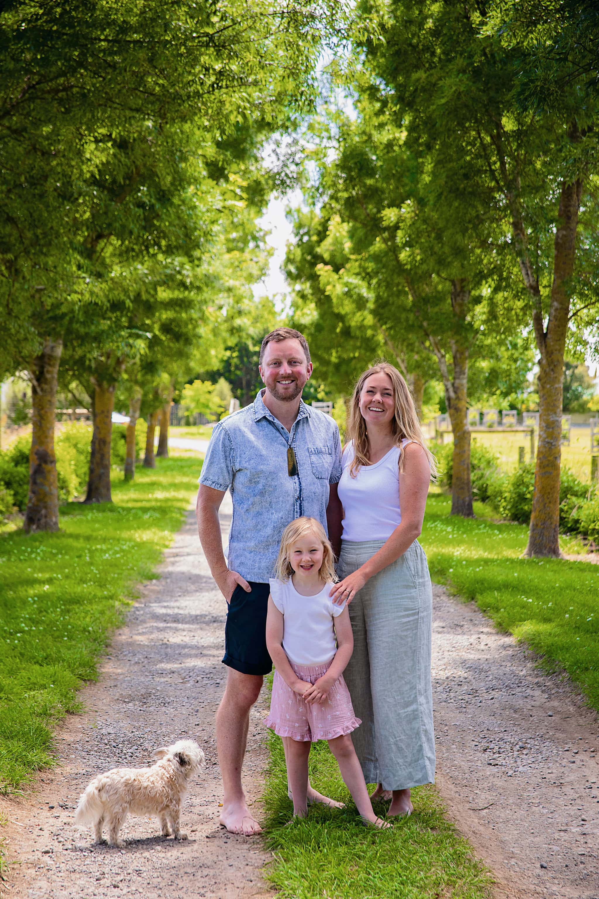

## Alumni Profile

# Sam Broughton

-   Leaving Year: [1999](https://www.middleton.school.nz/tag/1999/)

Tuhia ki te rangi

Tuhia ki te whenua

Tuhia ki te ngakau o ngā tangata

Ko te mea nui

Ko te aroha

Tihei mauri ora

Write it in the sky

Write it in the land

Write it in the hearts of all people

The greatest thing is love

Behold there is life

I started my time at Middleton Grange doing one year as a 5 year old with Miss Marton in 1986 before our family moved to the family farm near Darfield. I returned as a 13 year old in 1995 and had Mrs Gort as our awesome form teacher and ended Yr 13 in 1999. Following a year in the UK volunteering, Mr Steyn asked if I would be keen to help him as Sports Administrator. I loved supporting the schools sports, competitions, coaching, lunchtime games, balls and uniforms and mostly I loved supporting students to have fun and pursue their passions.

When I look back at my years at Middleton, I have so many good memories as a student including the friendships created, playing handball at lunchtime, falling in love, playing cricket and touch and football and athletics and fencing and tennis, $1 Chips and walking to Countdown, our barbershop quartet, Juicies, caring teachers like Mr. Masterton, sitting on the field in summer, cantamaths, and productions to name a few.

I left Middleton in 2005 and served as Youth Pastor at Darfield Baptist Church until 2016. Through these years I married Liz (Bayne) and together we ran the Day Spa at Terrace Downs, relocated a red zone house following the Canterbury earthquakes, and I was elected as a councillor for Selwyn District Council in 2010 and Mayor of Selwyn in 2016. Liz and I have a daughter Elliott, aged 6, and live in Darfield.

I love the privilidge of being Mayor of Selwyn which is home to over 85,000 people and constantly growing with new businesses and schools and passions and dreams that get lived out every day. Selwyn District is the land between the Waimakariri and Rakaia Rivers from Arthurs Pass to the Pacific Ocean. I try to be a values based leader and want to see others be their best. I encourage everyone to get involved with their local council, the place where community level discussions and decisions take place and budgets are approved. For some, that will be making a submission or requesting funding, for others it might be standing for election.

I am thankful for how school, and my parents and family, and sports clubs, and mentors didn’t just teach me technical knowledge or skills but to also be a person focussed on Love for others.

Ngā mihi  
Sam Broughton

[Back to Alumni](https://www.middleton.school.nz/alumni/)

### More Alumni Profiles

### [Stephanie Hunt (née Mathieson)](https://www.middleton.school.nz/stephanie-hunt-nee-mathieson/)

### [Caleb Croker](https://www.middleton.school.nz/caleb-croker/)

### [Ellen Paynter](https://www.middleton.school.nz/ellen-paynter/)

### [Elisha Nuttall](https://www.middleton.school.nz/elisha-nuttall/)

### [Frances Watson](https://www.middleton.school.nz/frances-watson/)

### [Geoff Wallis (Primary Teacher, 2016–2022)](https://www.middleton.school.nz/geoff-wallis-primary-teacher-2016-2022/)

[See all](https://www.middleton.school.nz/alumni-profiles/)
