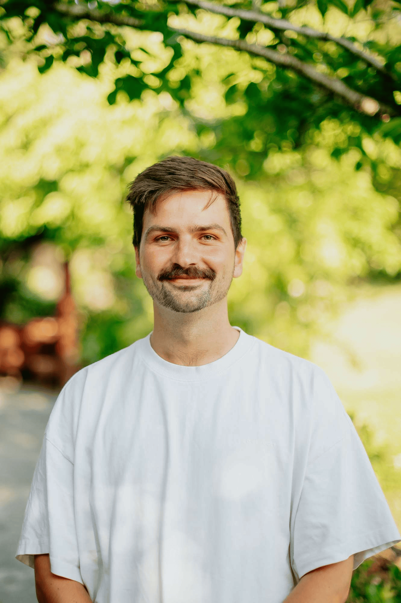

## Alumni Profile

# Sam Rees

-   Leaving Year: [2013](https://www.middleton.school.nz/tag/2013/)

I attended Middleton Grange for my NCEA years 11-13 (2011-2013). I look back at my experiences as a student with really fond memories. It was a pretty carefree time in my life with my biggest stressors only being whether I was able to hand in my assignments on time. I built a solid group of friends who I still catch up with weekly.

Other positive memories include sports tournaments, lifting up the house cup at the end of year 13, and just hanging around at break times with my friends. I know some people felt that Middleton Grange wasn’t for them, but it suited me extremely well and, because of this, I thrived.

Another reason I enjoyed Middleton so much was because of the teachers. When I was able to get under their sometimes rough exterior, I found that every one of them truly cared about what they were teaching and cared about me more than just as a student they were teaching. I remember the conversations and the jokes that we were able to share after class and the encouraging words they were able to speak over my life.

There is a saying that teachers are just people who peaked in high school and are just trying to relive their glory days… well that may ring true for my life. After school, I had no idea what I wanted to do. It was only after taking a gap year teaching English in schools around Thailand, and God opening door after door, that I found myself studying to become a teacher. Growing up, I never thought I would have the skills to become a teacher, but I truly believe that when God calls, He equips. Long story short, I graduated and eventually found my way back to Middleton Grange, but this time, actually being allowed into the staffroom. I have been teaching now for six years, four of which have been here at Middleton, and I cannot see myself doing anything else. Being able to create an environment where students are excited to come to school and balance the fun with the learning has been my goal, and I believe that I have slowly been able to achieve it. God has also been doing crazy things in the lives of our students, awakening real, tangible relationships with Him. Prayer and support for a true revival in our student cohort would be greatly appreciated.

One final exciting thing that is happening in my life is that my wife Shannon and I are expecting our first child in August. It’s funny, Shannon and I were both just friends at Middleton, and when I was at school, I never expected that one day, years after leaving school, we would be partnering in life with one another and eventually welcoming a new life into this world. For current students, you never know, your future spouse may be sitting right in front of you – God has amazing plans!

My final piece of advice to current Middleton Grange students is to not take yourself too seriously. Get out of your friend group and go and make new connections with others in your year group (or other year groups!). Too often, we are too insecure and create cliques, so we miss out on getting to know a whole bunch of people that may be our future mates in years to come.

[Back to Alumni](https://www.middleton.school.nz/alumni/)

### More Alumni Profiles

### [Stephanie Hunt (née Mathieson)](https://www.middleton.school.nz/stephanie-hunt-nee-mathieson/)

### [Caleb Croker](https://www.middleton.school.nz/caleb-croker/)

### [Ellen Paynter](https://www.middleton.school.nz/ellen-paynter/)

### [Elisha Nuttall](https://www.middleton.school.nz/elisha-nuttall/)

### [Frances Watson](https://www.middleton.school.nz/frances-watson/)

### [Geoff Wallis (Primary Teacher, 2016–2022)](https://www.middleton.school.nz/geoff-wallis-primary-teacher-2016-2022/)

[See all](https://www.middleton.school.nz/alumni-profiles/)
