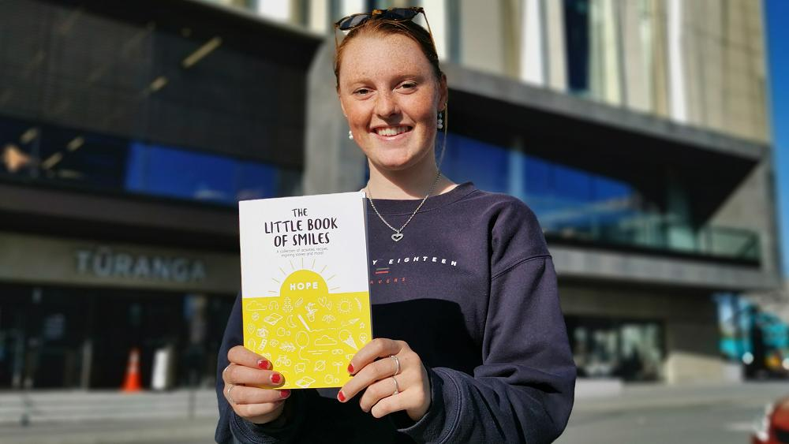

## Alumni Profile

# Samantha Fairhall

-   Leaving Year: [2018](https://www.middleton.school.nz/tag/2018/)

I graduated from Middleton Grange in 2018. I decided to take Year 13 Business Studies as a new subject and challenge not knowing it would lead me to the opportunities I have been given over the past 3 years. I was involved in the YES Enterprise scheme which worked alongside schools and their business groups. “The Little Book of Smiles” was the product of the business which is a Mental Health and Well-being book targeted at the youth and young adults of New Zealand. After 5 years of adventure and opportunities, I published this book on my 21st birthday in September last year 2021.

This journey began with 5 girls having an idea for a Mental Health and Wellbeing Book for the youth and young adults of New Zealand. Not only did my last year of High School fly by but so did our work on the book which meant we didn’t finish the content. After finishing school I took a gap year and went to America. I came home and with the help and support from both my parents, they said I should continue working on the book. We could see that New Zealand had a gap in their Mental Health resources for youth, and this book would be a great opportunity to fill this gap. I picked this project back up along with my studies at Ara to be an outdoor instructor. Between studying, working, and training I finished the content of the book which took me till mid-2020. The formatting of the book was the next step which I thought would be the final stage, but many alterations were made including Te Reo Maori. It was sent to the publishers in September 2021 and printed not long after.

While now studying psychology at the University of Canterbury I have to manage my time on both the book, studying, working, and training, so this is why it has been such a long but enjoyable journey.

To date, my book has been picked up by schools in New Zealand, parents, youth, and young adults along with counselors.  
The pathway I see for this book is in schools. It is a resource that has been written and published by a young adult in New Zealand for the youth and young adults of New Zealand. This is a book that teachers can refer to, teach from, and help children and youth understand the importance of Mental Health. It has been designed and created for both teachers and students and allows Mental Health to be a part of the school curriculum.

I was just recently awarded the ‘One to Watch Award at the YES Enterprise Alumni Awards evening. Which is awarded to an up-and-coming entrepreneur in New Zealand.  
Below are a few articles on the journey of the book and how I came to be the Founder and CEO of Hope for Happiness.  
[https://www.facebook.com/thelittlebookofsmiles](https://www.facebook.com/thelittlebookofsmiles)  
[https://www.newsline.ccc.govt.nz/news/story/the-story-of-a-little-book-with-a-big-heart](https://www.newsline.ccc.govt.nz/news/story/the-story-of-a-little-book-with-a-big-heart)  
[https://youngenterprise.org.nz/about/alumni](https://youngenterprise.org.nz/about/alumni) – Winner of the “One to Watch” Award at the YES Alumni Awards 2022  
[https://www.ara.ac.nz/news-and-events/news-stories/graduate-shines-a-spotlight-on-mental-health/](https://www.ara.ac.nz/news-and-events/news-stories/graduate-shines-a-spotlight-on-mental-health/)  
The Little Book of Smiles” is $25 each – Which can be ordered through the Facebook page or email.

[hopeforhappinesscampaign@gmail.com](mailto:hopeforhappinesscampaign@gmail.com)  
[https://www.instagram.com/hopeforhappiness\_/](https://www.instagram.com/hopeforhappiness_/)

[Back to Alumni](https://www.middleton.school.nz/alumni/)

### More Alumni Profiles

### [Stephanie Hunt (née Mathieson)](https://www.middleton.school.nz/stephanie-hunt-nee-mathieson/)

### [Caleb Croker](https://www.middleton.school.nz/caleb-croker/)

### [Ellen Paynter](https://www.middleton.school.nz/ellen-paynter/)

### [Elisha Nuttall](https://www.middleton.school.nz/elisha-nuttall/)

### [Frances Watson](https://www.middleton.school.nz/frances-watson/)

### [Geoff Wallis (Primary Teacher, 2016–2022)](https://www.middleton.school.nz/geoff-wallis-primary-teacher-2016-2022/)

[See all](https://www.middleton.school.nz/alumni-profiles/)
