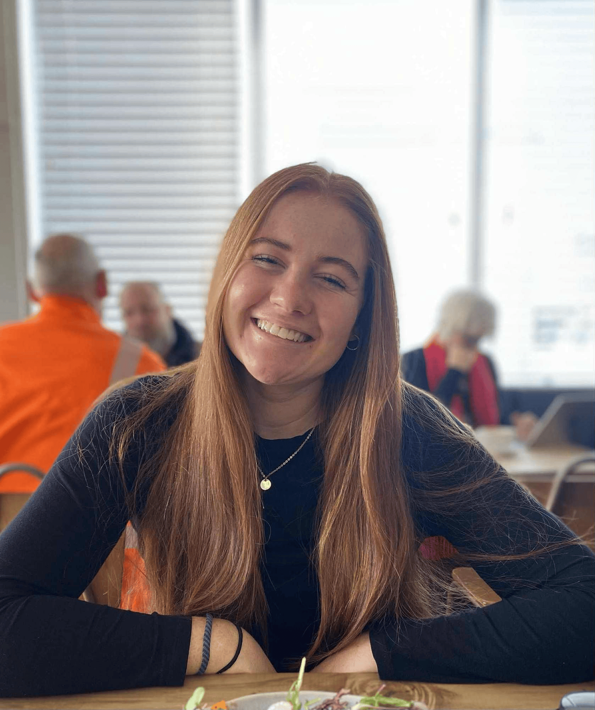

## Alumni Profile

# Samantha (Sam) Ayers

-   Leaving Year: [2021](https://www.middleton.school.nz/tag/2021/)

**Tēnā koutou katoa**

Ko te Atua taku piringa

I whānau mai ahau ki raro i a Ōpuke

I tipu ake ahau ki ngā tahataha o Rākaia

Kei Ōtautahi au e noho ana

He kaimahi rangatahi au i Kawai Rangatahi

Ko Grace Vineyard te wharekarakia

Ko Andy rāua ko Alison ōku mātua

Ko Zac rāua ko Seb ōku tungāne

Ko Lucy taku tuakana

Ko Amy taku teina

Ko Ayers taku ingoa whānau

Ko Sam taku ingoa

Nō reira, tēnā koutou katoa

Kia ora, my name is Samantha Ayers, and I attended Middleton Grange School from 2019 to 2021 for my final three years of high school.

I look back on my time at Middleton with so much gratitude, and high school was such a fun time for me! I have countless fond memories, from school productions to sports events and leadership opportunities. A highlight for me was being part of the 2021 production *Oliver!* – an unforgettable experience where I grew in confidence, developed my drama and dance skills, and made lifelong friendships. Mr McCormack’s leadership made the cast feel like family, and that sense of belonging was really special.

Another highlight was playing for the “Lady Raiders” football team. Every Wednesday, we had such a good time out on the field, proudly wearing our bright pink socks and cheered on by dedicated supporters. In my final year, I also had the privilege of serving as a Head Prefect. One of my favourite moments was surprising the school with a flash mob during assembly. It was a creative way to make a notice memorable, and it was another fun way to make my last year at Middleton so unforgettable. Leading Wilson House to victory in lip sync and house singing competitions was another proud moment. These experiences taught me the joy of teamwork and the importance of getting stuck in and giving things a go. It was so fun dressing up in bright green crazy outfits and having heaps of fun with my friends!

Since leaving Middleton, life has been a real adventure. Although I dreamed of going overseas after high school, the Covid-19 pandemic meant plans were uncertain. I started working in hospitality before I had an exciting ‘God moment’ at church and felt lead to last minute apply to work at a summer camp in Canada in 2022. Two weeks later, I found myself living in Canada! That decision was life-changing. I discovered a passion for youth work while counselling and mentoring young girls. After camp, I travelled through the United States, then returned home to New Zealand, where my dad and I completed *Te Araroa* – a 3,000 km hiking trail stretching the length of the country. Walking for nearly five months was both challenging and deeply rewarding, and it grew my appreciation for nature and God’s creation. It was such a special time getting to spend it with my dad and also meeting so many hikers along the way and hearing their stories.

I returned to Canada in 2023 to work at the same camp, this time as a leader and public speaker. Sharing about God with young people and discovering a passion for preaching was a transformative experience. I loved working with my best friends but also growing in my confidence on stage and using them to bring youth to God. After that summer, I moved back to Christchurch, where I interned with Grace Vineyard City Campus, working with the youth group. This internship opened the door to my current role with *24/7 YouthWork* through the trust *Kawai Rangatahi*. I now have the privilege of supporting young people in schools on Christchurch’s east side, mentoring young women, and running resilience groups that teach life skills. I absolutely love my job and hearing about what is happening everyday in the lives of young people and getting to journey with them in that.

God has moved powerfully in my life, especially through youth work. Whether it’s praying with young people who have never heard of Him before, watching peers take steps of faith such as baptism, or simply seeing lives transformed by His love, I feel incredibly blessed to witness His work up close. It definitely hasn’t been easy at times, but God is so good and faithful to us all the time. I have loved getting to witness Him work in the lives around me but I am also so thankful to know my father who is always there through everything.

Be bold and explore the world around you. Don’t worry if you don’t have everything figured out right away. Life with God is a journey full of adventure. Since leaving school, I’ve lived in Canada, hiked the length of New Zealand, built amazing friendships, worked in roles I’m passionate about, and seen young people come to faith. Each step has reminded me that God is in control, and walking with Him makes life the greatest adventure of all.

[Back to Alumni](https://www.middleton.school.nz/alumni/)

### More Alumni Profiles

### [Stephanie Hunt (née Mathieson)](https://www.middleton.school.nz/stephanie-hunt-nee-mathieson/)

### [Caleb Croker](https://www.middleton.school.nz/caleb-croker/)

### [Ellen Paynter](https://www.middleton.school.nz/ellen-paynter/)

### [Elisha Nuttall](https://www.middleton.school.nz/elisha-nuttall/)

### [Frances Watson](https://www.middleton.school.nz/frances-watson/)

### [Geoff Wallis (Primary Teacher, 2016–2022)](https://www.middleton.school.nz/geoff-wallis-primary-teacher-2016-2022/)

[See all](https://www.middleton.school.nz/alumni-profiles/)
