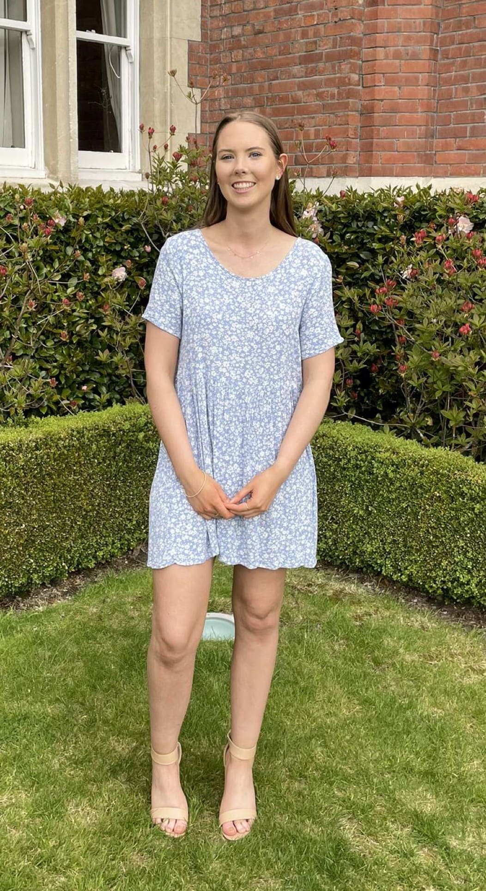

## Alumni Profile

# Sophie Onslow

-   Leaving Year: [2020](https://www.middleton.school.nz/tag/2020/)

I was honoured when asked to share a bit about myself and my life post-Middleton, so I hope that whoever you are, you would feel blessed and encouraged by reading a bit about my story.

After moving to New Zealand in 2009, I began at Hillview Christian School and then in 2018 made the transition at the start of year 11 to Middleton. What a whirlwind those subsequent three years were! It was such a pivotal time in shaping me into who I am today. My time at Middleton was full of so many opportunities, and I came away with lifelong friends as well as a clear idea of what I wanted to go on to do after school.

In 2021, I made the move to Dunedin to do Health Science but what a crazy year that was (between Covid and moving away from home), so I ended up deciding to switch directions to pursue a degree in Psychology. This was one of the best decisions I have ever made, and I am now in my final year of my degree. I would strongly encourage anyone going on to further study, if for whatever reason you don’t find yourself enjoying your initial choice, don’t feel like you’re trapped, change it.

The last three years have shown me time and time again that God will continue to provide even when life seems to be overwhelming. I have been involved in the young adults community at Elim for the past three years, and it has proven to be such an incredible place to grow both as a person but also in my faith. I continue to be amazed at how God can take our own plans and ideas and switch them completely but in the best possible ways. “Within your heart you can make plans for your future, but the Lord chooses the steps you take to get there” Proverbs 16:9 (TPT).

Next year looks very different as I am heading off to America to work at a summer camp. This is going to be such a blessing and will be an incredible opportunity to go back to working with kids after a few years away from youth work. Going straight from school to university showed me that whilst working hard is so important, so is taking time off to do something you love.

Some final thoughts, whilst study is, for many people, super important, there is more to life than grades and university, so if you do go on to further education (or even for people who don’t), remember to prioritise your whole wellbeing – physical, spiritual, & mental. University has taught me that no matter what you end up pursuing in life, use every opportunity and go out of your comfort zone to try different things – even if you don’t like it or at times feel uncomfortable. Pushing yourself will be where you see the biggest growth!

[Back to Alumni](https://www.middleton.school.nz/alumni/)

### More Alumni Profiles

### [Stephanie Hunt (née Mathieson)](https://www.middleton.school.nz/stephanie-hunt-nee-mathieson/)

### [Caleb Croker](https://www.middleton.school.nz/caleb-croker/)

### [Ellen Paynter](https://www.middleton.school.nz/ellen-paynter/)

### [Elisha Nuttall](https://www.middleton.school.nz/elisha-nuttall/)

### [Frances Watson](https://www.middleton.school.nz/frances-watson/)

### [Geoff Wallis (Primary Teacher, 2016–2022)](https://www.middleton.school.nz/geoff-wallis-primary-teacher-2016-2022/)

[See all](https://www.middleton.school.nz/alumni-profiles/)
