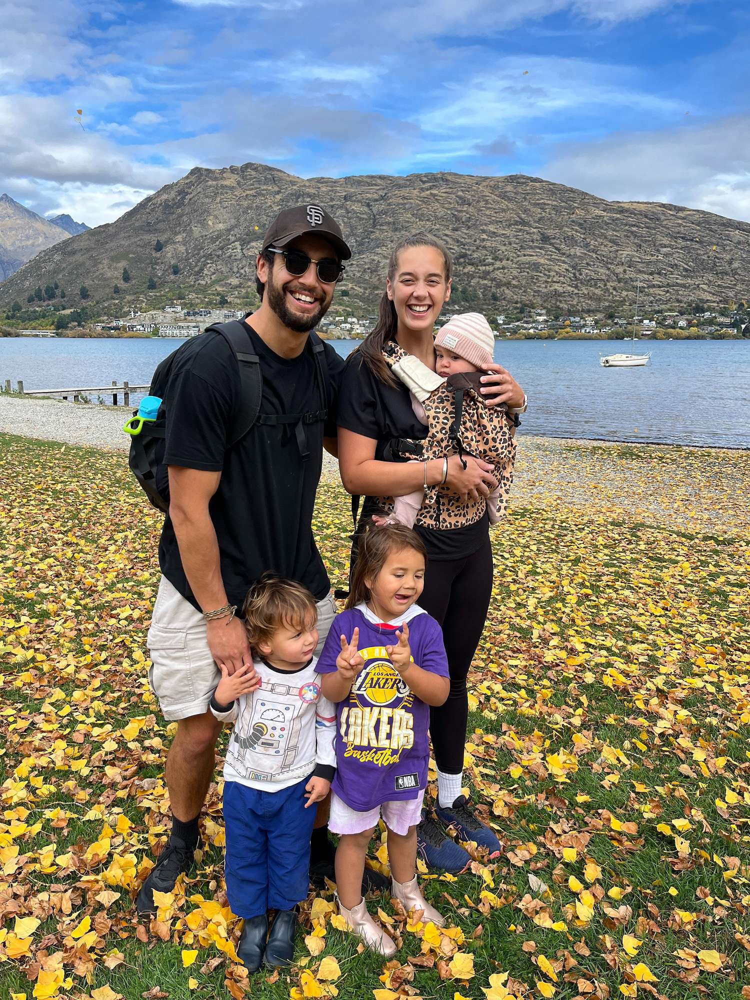

## Alumni Profile

# Sophie Te Awa (née Barnett)

-   Leaving Year: [2013](https://www.middleton.school.nz/tag/2013/)

Kia ora,

My name is Sophie Te Awa (née Barnett), and I attended Middleton Grange School from Year 0 through to Year 13, graduating in 2013.

I loved my time at Middleton, especially getting to attend alongside all three of my sisters. One of the things I appreciated most was the continuity of being part of a school that spans from Year 0 to Year 13—it truly made us feel like one big extended family. I made friendships in Year 1 that remain some of my dearest to this day, which feels incredibly special.

I have many fond memories of my time at school: house competitions, school trips, and particularly the end-of-year traditions like service days, activity days, and watching the teachers relax a little—those were always fun! Ha! I still remember the excitement of the last day of the school year in primary, eagerly waiting to find out who our teacher and classmates would be for the following year.

Some little moments still stick with me—like eating too much chocolate in Year 12 cooking, or Mr. Utting’s famously strict stance on uniform rules. But one of the most lasting impressions was from Mr. Vanderpyl. His commitment to the students went far beyond the norm—he made a point of knowing everyone by name, and you’d often see him on the sidelines at school sports games, even on weekends. He was the kind of leader who made a lasting impact, and looking back, I can see just how much he helped shape the culture and heart of the school.

After leaving Middleton, I studied and worked as a speech-language pathologist. My first role was at Van Asch Deaf Education Centre, where I gained a deep appreciation for Deaf culture and learned New Zealand Sign Language (NZSL). I married my high school sweetheart, and now we’ve got three little ones under the age of three! They bring us so much joy—and a whole lot of chaos. Parenting has been one of the most rewarding journeys. Watching them grow has taught me so much about God’s love and has deepened my understanding of who He is through the beauty of His creation.

Together, my husband and I have also been part of planting a church in our local community. It’s been amazing to watch those first seeds begin to grow, and I’m excited to see all that God has in store for our family and our church as we continue to grow together.

If I could offer one piece of advice to current students at Middleton, it would be this: soak up the joy and freedom of student life. Try to keep things in perspective—I put far too much pressure on myself during those years. Do your best, and remember: your best is always enough. Embrace every opportunity that comes your way. They truly are some of the best years of your life.

Ngā mihi,

Sophie.

[Back to Alumni](https://www.middleton.school.nz/alumni/)

### More Alumni Profiles

### [Stephanie Hunt (née Mathieson)](https://www.middleton.school.nz/stephanie-hunt-nee-mathieson/)

### [Caleb Croker](https://www.middleton.school.nz/caleb-croker/)

### [Ellen Paynter](https://www.middleton.school.nz/ellen-paynter/)

### [Elisha Nuttall](https://www.middleton.school.nz/elisha-nuttall/)

### [Frances Watson](https://www.middleton.school.nz/frances-watson/)

### [Geoff Wallis (Primary Teacher, 2016–2022)](https://www.middleton.school.nz/geoff-wallis-primary-teacher-2016-2022/)

[See all](https://www.middleton.school.nz/alumni-profiles/)
