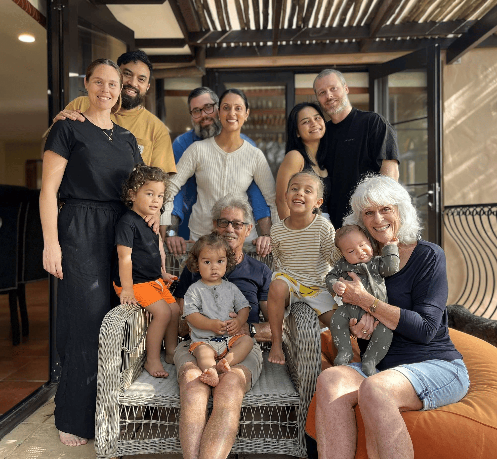

## Alumni Profile

# Stephanie Hunt (née Mathieson)

-   Leaving Year: [1971](https://www.middleton.school.nz/tag/1971/)

Hi, my name is Stephanie Hunt (née Mathieson), and I attended Middleton Grange from 1966 to 1971.

I’ve been married to Glen for 42 years, and we have two sons and a daughter, all happily married, as well as four grandchildren (so far!). What an adventure life has been!

My years at Middleton Grange truly shaped who I am today — albeit with a lot of moulding by God (and some arguing from me) along the way to get here! ❣️

**School Memories**

-   Teachers who cared for each of us individually, despite our rebellious streaks (thanks, Mr H).
-   Being encouraged to discover our talents (thanks, Mr Kent) and to persevere in growing them — even through class speeches!
-   Learning to give everything a go without fear of ridicule.
-   Being taught to do our best and that tackling subjects we didn’t like (such as sewing!) didn’t hurt us.
-   Forming meaningful, lifelong friendships that have lasted the distance and that we still invest in and enjoy today.

**Life After School**

After registering as a nurse in Christchurch, I spent a few years seeing the world and working in a variety of roles — nursing in Australia, barmaiding in the dodgy Soho area of London, waitressing and working as a maid in a converted castle in Scotland, nannying for an Irish couple in Spain who ran a bar, and plastic surgery nursing in Essex, England.

When our boys were very young, we accepted God’s call to serve in Kenya with Africa Inland Mission, where we spent seven years in two different areas. Glen did all things practical and preached, while I provided healthcare, led Ladies’ Bible Studies, and homeschooled our children. Our second daughter was born there.

We witnessed many miracles of faith and learned so much about the diversity of people groups and the daily challenges they face just to survive. It was a wonderful privilege to live there, see God at work, and raise our family. Life in Kenya was unimaginable for most Kiwis, but by God’s grace we survived (literally), and it forged unbreakable family bonds.

**Life Today**

I’ve been working in ICU at Whakatāne Hospital for 25 years and still love it! 🥳

I especially enjoy working with new graduates and overseas nurses, helping them feel valued and welcomed.

No plans to retire just yet — I may be the oldest relic in our unit, but I can still run the fastest in an emergency! 🤩

**Advice for Current Students**

Enjoy, treasure, learn, and remember what’s important in life — and take it to the world! ❣️

[Back to Alumni](https://www.middleton.school.nz/alumni/)

### More Alumni Profiles

### [Stephanie Hunt (née Mathieson)](https://www.middleton.school.nz/stephanie-hunt-nee-mathieson/)

### [Caleb Croker](https://www.middleton.school.nz/caleb-croker/)

### [Ellen Paynter](https://www.middleton.school.nz/ellen-paynter/)

### [Elisha Nuttall](https://www.middleton.school.nz/elisha-nuttall/)

### [Frances Watson](https://www.middleton.school.nz/frances-watson/)

### [Geoff Wallis (Primary Teacher, 2016–2022)](https://www.middleton.school.nz/geoff-wallis-primary-teacher-2016-2022/)

[See all](https://www.middleton.school.nz/alumni-profiles/)
