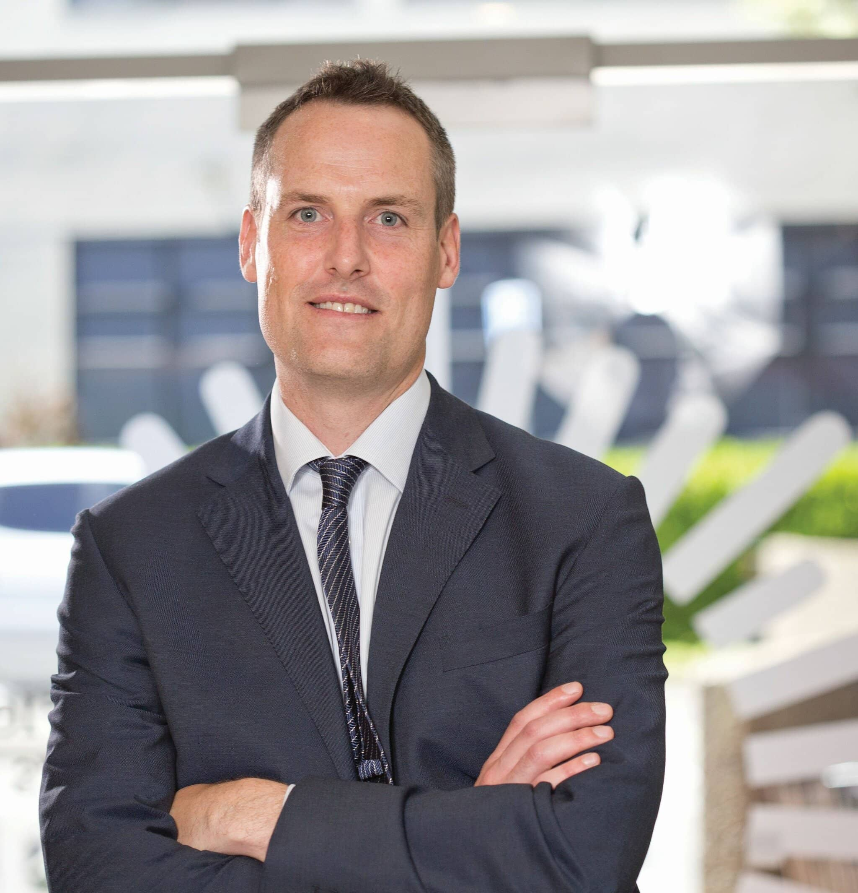

## Alumni Profile

# Steven Moe

-   Leaving Year: [1994](https://www.middleton.school.nz/tag/1994/)

Lawyer and Podcaster: Steven Moe shares some of his journey (attended 1989-1994)

I remember clearly starting mid-way through 1989 at Middleton Grange.  I had come from a school overseas where there were no uniforms and it had been summer, so it was a shock to arrive in cold July weather in “Form 2” wearing shorts!  I enjoyed my time at Middleton Grange for the next 5 years, and made good friends along the way.  I was active in some of the original basketball teams that had undefeated seasons in 1993/94 as well as playing a lot of Tennis in the summer. After graduating in 1994 I studied Law at Canterbury University until 2001 (with a year teaching English in Japan as well).   After a few years in Wellington working at a large law firm I went to a much bigger law firm in London with 4,000 lawyers.  Being based in London was great for trips and my wife and I had three years there as well as welcoming our first child Shanna Moe (who is now in Year 10 at Middleton Grange).  We next moved to Tokyo where I worked for four years for the same firm and we had our second daughter Ayala Moe (now in year 8 at Middleton Grange).  Four years in Sydney saw Isabel and Isaac join our family and when they all came home singing the Australian national anthem, we knew it was time to head back to Aotearoa.  We got back at the start of 2016 and I am now a Partner in local law firm Parry Field Lawyers.  My focus is on purpose driven organisations and I do a lot of work with not for profits as well as social enterprises – entities that combine profit and purpose.  As well as writing a book or two on those topics I host a weekly podcast called Seeds Podcast which has more than 300 interviews of inspiring Kiwis and has been listened to more than 150,000 times.  I enjoy writing articles for Spinoff and Stuff on purpose focused initiatives and am also the Chair of Community Finance which has raised almost $100 million for social housing in the last two years.  Looking back, I think Middleton Grange was a great place to grow and develop and nurture some roots of social conscience that formed more completely much later.  I now see the ‘circle of life’ continuing when I drop my children in the place where my Father used to drop me!

[Back to Alumni](https://www.middleton.school.nz/alumni/)

### More Alumni Profiles

### [Stephanie Hunt (née Mathieson)](https://www.middleton.school.nz/stephanie-hunt-nee-mathieson/)

### [Caleb Croker](https://www.middleton.school.nz/caleb-croker/)

### [Ellen Paynter](https://www.middleton.school.nz/ellen-paynter/)

### [Elisha Nuttall](https://www.middleton.school.nz/elisha-nuttall/)

### [Frances Watson](https://www.middleton.school.nz/frances-watson/)

### [Geoff Wallis (Primary Teacher, 2016–2022)](https://www.middleton.school.nz/geoff-wallis-primary-teacher-2016-2022/)

[See all](https://www.middleton.school.nz/alumni-profiles/)
