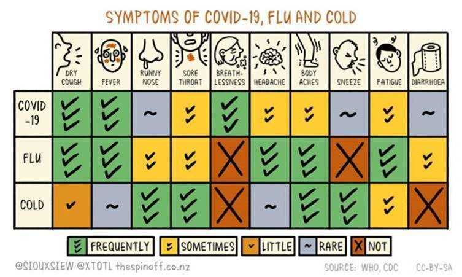

## News

# Symptoms of Covid-19, Flu and Cold

-   [March 23, 2020](https://www.middleton.school.nz/2020/03/23/)

Please see this poster that has been provided by the Ministry of Health regarding symptoms of COVID-19, colds and flu.

Hi everyone,

The following measures are now in place at Middleton Grange School (until further notice)

• No physical contact with others while at school  
• We will all practice socially acceptable distance between each other  
• No sharing water bottles  
• No cakes/shared food  
• You must wash and dry your hands thoroughly after going to the toilet  
• It is critical that you maintain your own personal hygiene  
• No physical contact in Physical Education or in the playground  
• No physical contact in Dance/Drama etc  
• Desks are to be separated in all classes where possible.  
• The class roll will be taken at the start of each class  
• Students will be in a seating plan in case the MOH require information of who sat next to whom  
• Canteen line must have the appropriate distance between all students at all times  
• Weights room will be closed  
• Year 13 Study Room will be closed during breaks  
• Production end of Term 2 has been cancelled  
• All Kapa Haka has been cancelled

A deep clean has been undertaken on Sunday afternoon on all high-touch areas including all kitchen spaces, all desktops, all door handles with a product that has a 3 weeks efficacy.

Thank you for supporting us and praying for us as a school. We are part of an amazing community!

#### Archives

Archives Select Month February 2026 April 2024 March 2024 September 2023 June 2023 May 2023 December 2022 October 2022 September 2022 July 2022 June 2022 April 2022 March 2022 February 2022 January 2022 December 2021 October 2021 August 2021 February 2021 January 2021 September 2020 August 2020 May 2020 April 2020 March 2020 February 2020 January 2020 November 2019 September 2019 August 2018 June 2018 May 2018 February 2018 December 2017 October 2017 September 2017 July 2017 June 2017 May 2017 April 2017 March 2017 February 2017 January 2017 December 2016 November 2016 October 2016 August 2016 July 2016 June 2016 May 2016 April 2016 March 2016 February 2016 December 2015 October 2015 September 2015 August 2015
