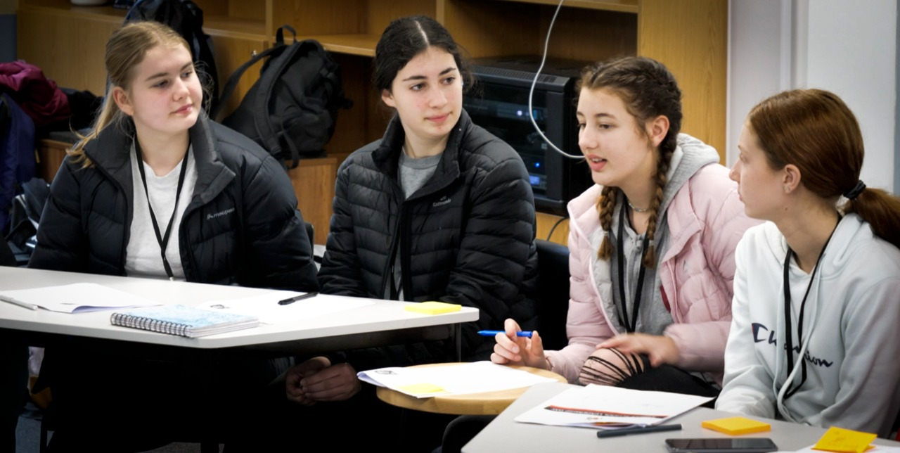

# Lab Days

-   [Vision](https://www.middleton.school.nz/te-ohu-kahika-vision/)
-   [Lab Days](https://www.middleton.school.nz/te-ohu-kahika-labs/)
-   [Sponsorship](https://www.middleton.school.nz/te-ohu-kahika-sponsorship/)
-   [Current Workshops](https://www.middleton.school.nz/te-ohu-kahika-workshops/)
-   [Te Ohu Kahika](https://www.middleton.school.nz/te-ohu-kahika/)

**CREATIVE LAB**

A creative is an artist, an individual and a thought leader.  When these imaginative and often independant people are celebrated and encouraged to give voice to their different perspectives and diverse talents, the world is enriched and new futures created. Creative Lab draws together our creatively talented pupils and exposes them to a wide range of artists and thinkers who challenge them to think bigger, think Kingdom, think influence with their gifts – to create an awareness that their creative talents can afford them a voice in our nation to influence the arts, media, entertainment and boardroom spheres.

Creative Lab 2020 with guest artists Wayne and Libby Huirua

**ENTREPRENURIAL LAB**

Bravery, vision, fortitude, generosity, respect and honesty are values that sustain the entrepreneur.  The Entreprenurial Lab is a day set apart to invest into pupils who have the emerging talent to drive innovation, create wealth and improve standards of living.

**WOMEN IN LEADERSHIP IN LAB**

The trajectory to female leadership starts early and is defined by key influences throughout life. The Women in Leadership Lab is designed to expose Middelton Grange girls to influential women who are models for how to lead and how to become leaders in corporations, governments, academic institutions and other organisations.

**MONEYWI$E LAB**

Money matters and learning early in life the psychology of money as well as the practical skills of budgetting, avoiding debt and paying off students loans gives pupils the platform to stand strong and use their time and resource for well. Year 12 and Year 13 pupils are offered the opportunity to sit under sound financial experts from the community and business sector.
