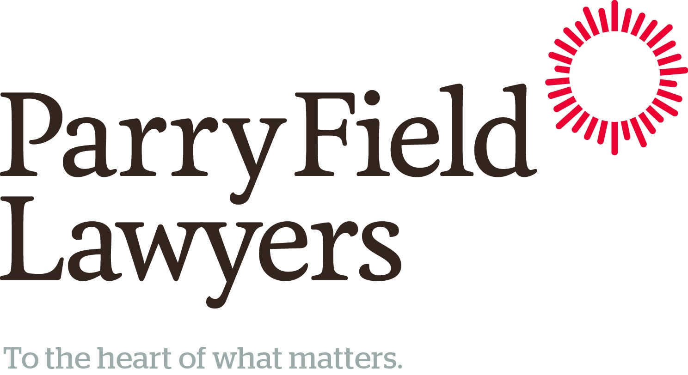
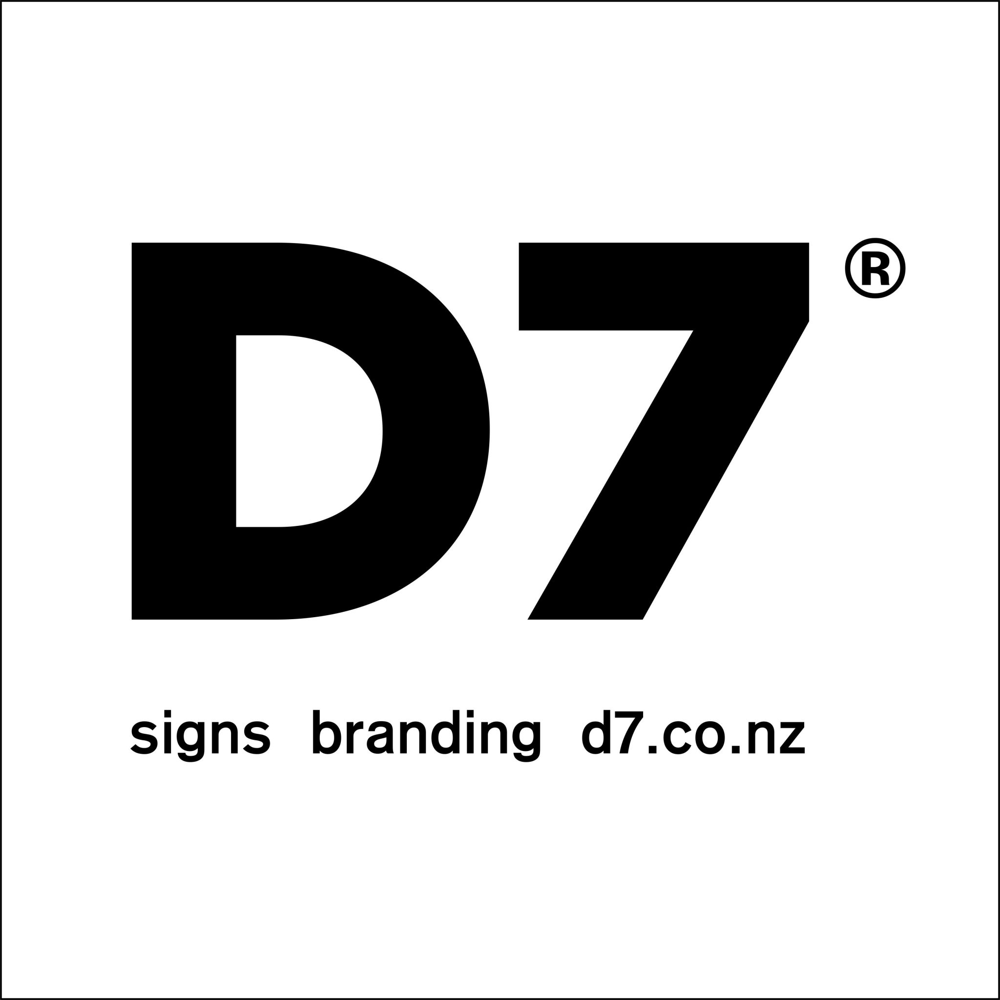

# Sponsorship

-   [Vision](https://www.middleton.school.nz/te-ohu-kahika-vision/)
-   [Lab Days](https://www.middleton.school.nz/te-ohu-kahika-labs/)
-   [Sponsorship](https://www.middleton.school.nz/te-ohu-kahika-sponsorship/)
-   [Current Workshops](https://www.middleton.school.nz/te-ohu-kahika-workshops/)
-   [Te Ohu Kahika](https://www.middleton.school.nz/te-ohu-kahika/)

## "For where your treasure is, there your heart will be also"

The work done in the Kahika Centre relies on the generosity of sponsorship; individuals and organisations who understand that the leadership acumen that we are sowing into this generation will one day see influential men and women standing tall with respected voices in our communities and nations.

Sponsorship is more than finance; it is opportunity and empowerment to continue to see this new and pioneering venture flourish. It is opportunity to see every single pupil equipped with practical leadership skills they can take into every arena of life. It is opportunity to sow into a future generation.

If you would like to sponsor the vision and work done in the Kahika Centre, please email **k.malcolm@middleton.school.nz**

## Current Sponsors

**PRINCIPAL SPONSORS**

**SUPPORTING SPONSORS**

D7 Signs Branding
