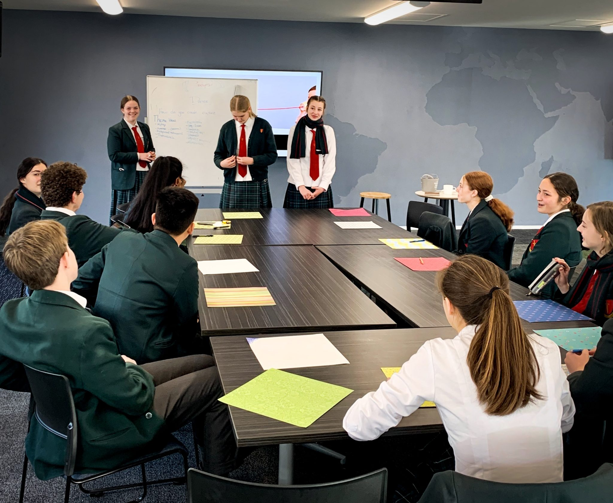

# Vision

-   [Vision](https://www.middleton.school.nz/te-ohu-kahika-vision/)
-   [Lab Days](https://www.middleton.school.nz/te-ohu-kahika-labs/)
-   [Sponsorship](https://www.middleton.school.nz/te-ohu-kahika-sponsorship/)
-   [Current Workshops](https://www.middleton.school.nz/te-ohu-kahika-workshops/)
-   [Te Ohu Kahika](https://www.middleton.school.nz/te-ohu-kahika/)

## "Leadership is influence, nothing more; nothing less."

Middleton Grange School is a seedpod of potential cultural transformation.  

Te Ohu Kahika exists to release young men and women into our nation equipped not just with an exceptional education, but with insight into their unique gifting, armed with leadership acumen, interpersonal skills and actively engaged in a greater purpose for their lives. The Kahika Centre aims to prepare and empower a young generation to be the influencers; the voices; the transformers; the mighty trees in every arena of our nation.

Yr10 Middle School leaders learning how to run effective meetings.
