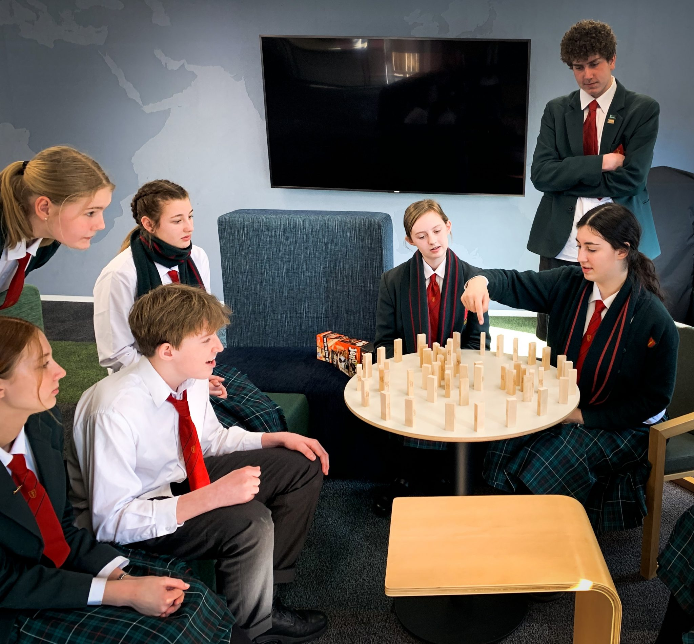
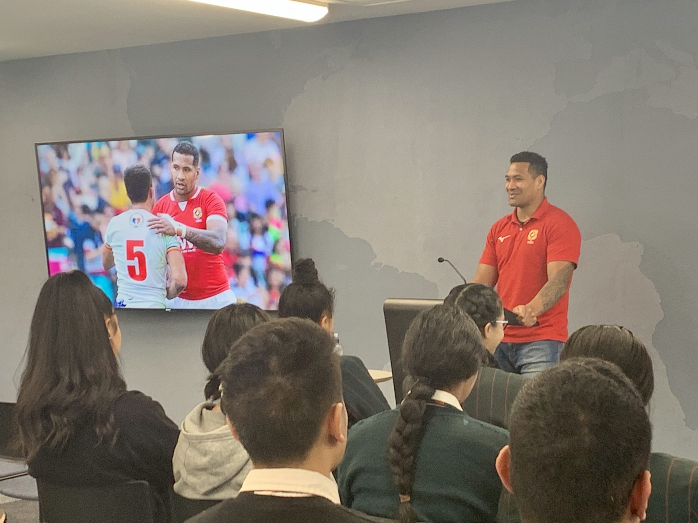
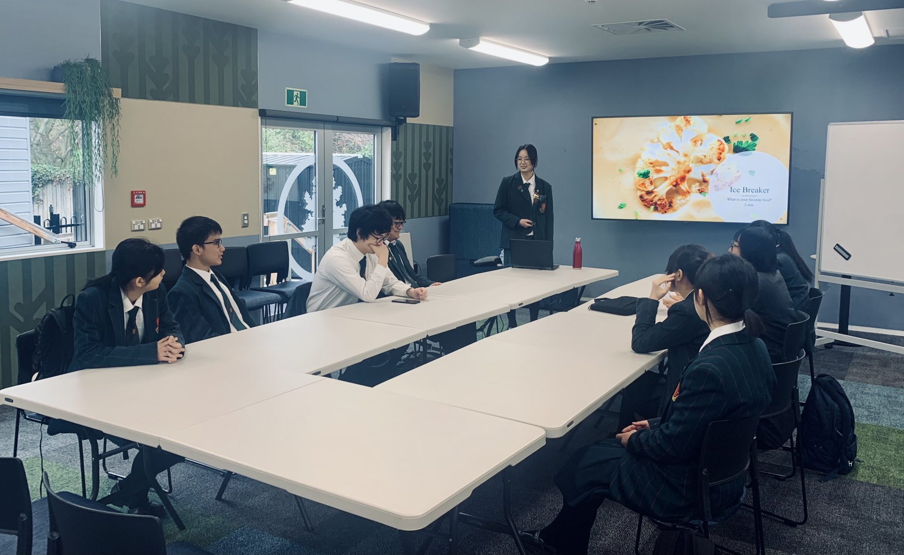

# Current Workshops

-   [Vision](https://www.middleton.school.nz/te-ohu-kahika-vision/)
-   [Lab Days](https://www.middleton.school.nz/te-ohu-kahika-labs/)
-   [Sponsorship](https://www.middleton.school.nz/te-ohu-kahika-sponsorship/)
-   [Current Workshops](https://www.middleton.school.nz/te-ohu-kahika-workshops/)
-   [Te Ohu Kahika](https://www.middleton.school.nz/te-ohu-kahika/)

## “If serving is below you, leadership is beyond you.”

The Kahika Centre hosts a variety of workshops throughout the year to prepare and empower a young generation with the interpersonal skills necessary to be the influencers, the voices, the transformers, the mighty trees in every arena of our nation.

**Current workshops offered:**

-   Effective Communication
-   Listening Skills
-   Leading Meetings
-   Know Thy Self –  Values
-   Emotional Intelligence
-   Resilience
-   Servant Leadership
-   Individual Strengths Coaching
-   Team Strengths Coaching
-   The Role of the CEO
-   Team Dynamics
-   Understanding Influence
-   The Power of Culture
-   Leading with Character
-   Giving Feedback
-   Study Smart – Effective study techniques

Pupils unpacking the difference between leadership and influence

**PASIFIKA LEADERSHIP DAY**

Our annual Pasifika Leadership Day is hosted in the Kahika Centre with schools from across Christchurch attending the day. It is a highlight in the school calendar for the Pasifika pupils and boasts guests speakers from the Pasifika community, lots of laughs, and an admirable amount of pizza consumed. Pupils are inspired to stand proud in their hertiage and speak boldly with a voice that is rich in culture and influence.

**INTERNATIONAL COLLEGE LEADERS**

The International College pupil leaders attend a leadership development programme throughout the year in the Kahika Centre. They learn valuable skills in cross cultural leadership that develop them personally for their futures in the countries they return home to or adopt.

