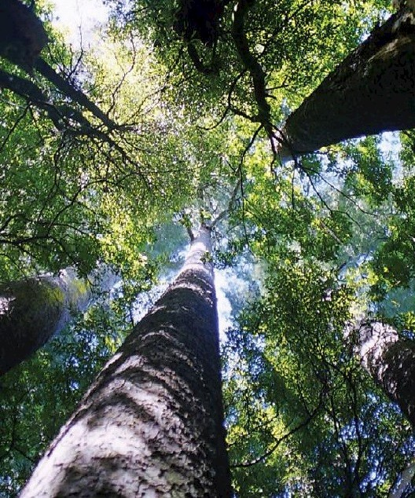
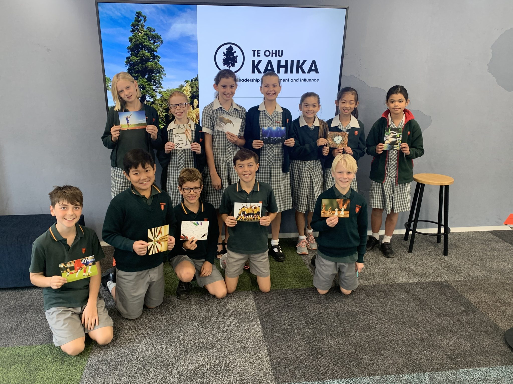

# Te Ohu Kahika

-   [Vision](https://www.middleton.school.nz/te-ohu-kahika-vision/)
-   [Lab Days](https://www.middleton.school.nz/te-ohu-kahika-labs/)
-   [Sponsorship](https://www.middleton.school.nz/te-ohu-kahika-sponsorship/)
-   [Current Workshops](https://www.middleton.school.nz/te-ohu-kahika-workshops/)
-   [Te Ohu Kahika](https://www.middleton.school.nz/te-ohu-kahika/)

## ‘Te Ohu Kahika’

*“…and they will be called mighty trees, a planting for the display of His splendour.”* Isaiah 61

**Whakamārama (Explanation)**

The Kahika (white pine) is a tall coniferous tree of mainly swampy ground, the leaves are soft to touch. The tree is known to group with other kahikatea, intertwining roots with its neighbours for support in the unstable ground. The entwining of roots enables it to huddle with others for stability. In traditional proverbs, it features as a symbol of encouragement and ambition. Kahika traditionally grew in large numbers around the general area of Middleton Grange’s current school site.

The Kahika is the largest indigenous tree in Aotearoa and in te reo Māori can also translate to be a direct metaphor for a chief or leader.

It has an interesting growth pattern with its roots as a symbol of strength in unity. Traditionally the creamy-white wood of the Kahika/ kahikatea was used for canoemaking by Māori as well as bird spears. Kahika have red berries that were harvested in summer called koroī for kai and the leaves were used as traditional rongoā (medicine) to treat kidney problems and external bruising.

Kahika is an obvious symbol of leadership. The root system symbolises the importance of whānau and collaboration in times of uncertainty in the world. The kahika also fits nicely with the idea of being displayed for His splendour as it can easily be seen due to its mighty height.

The beginning of the name ‘Te Ohu’ speaks to the idea of a cooperative group, thus Te Ohu Kahika being the cooperative group of leaders at Middleton Grange School working together in collaboration, strength, and unity for the display of His splendour

