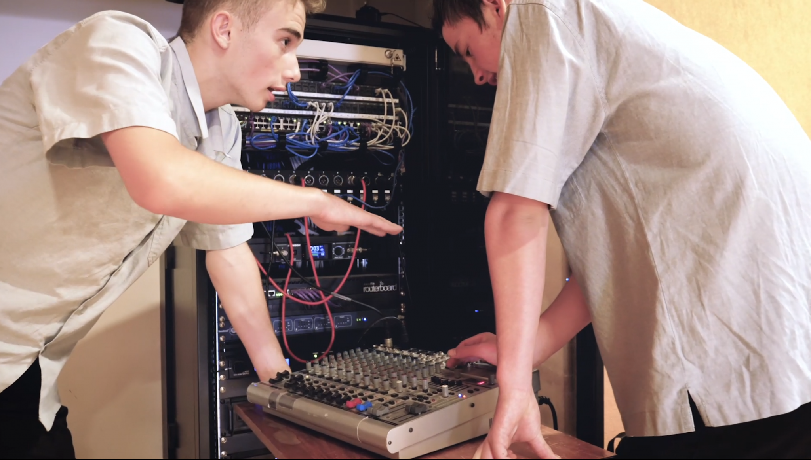
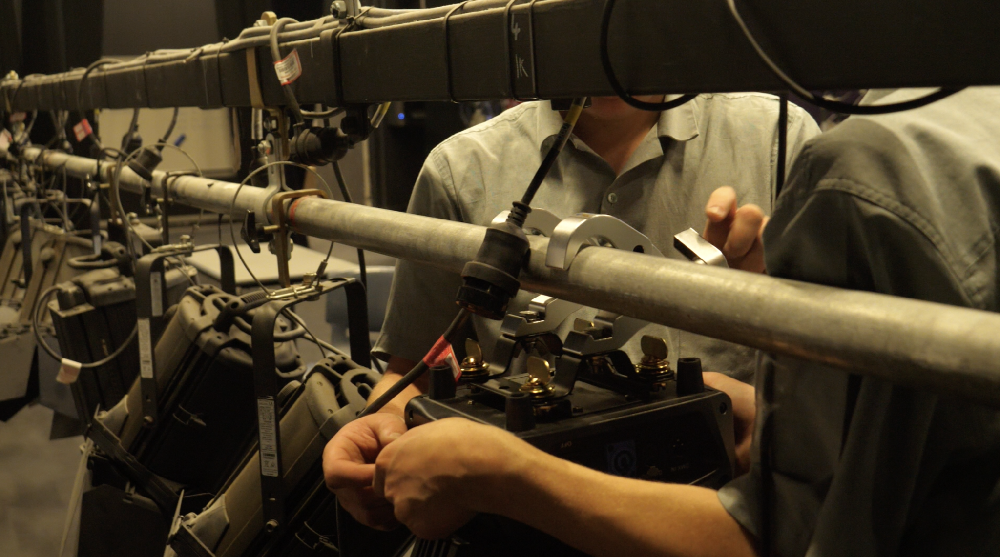
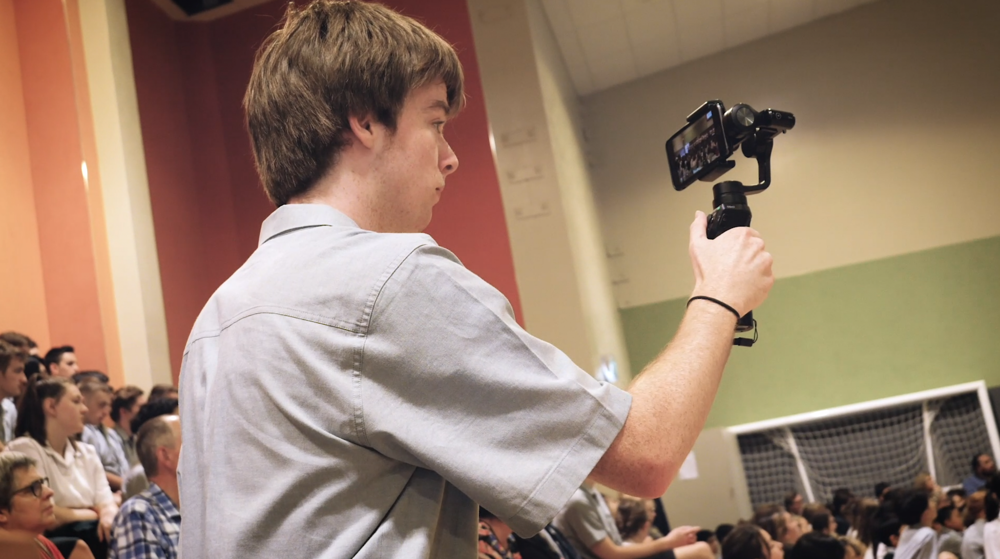
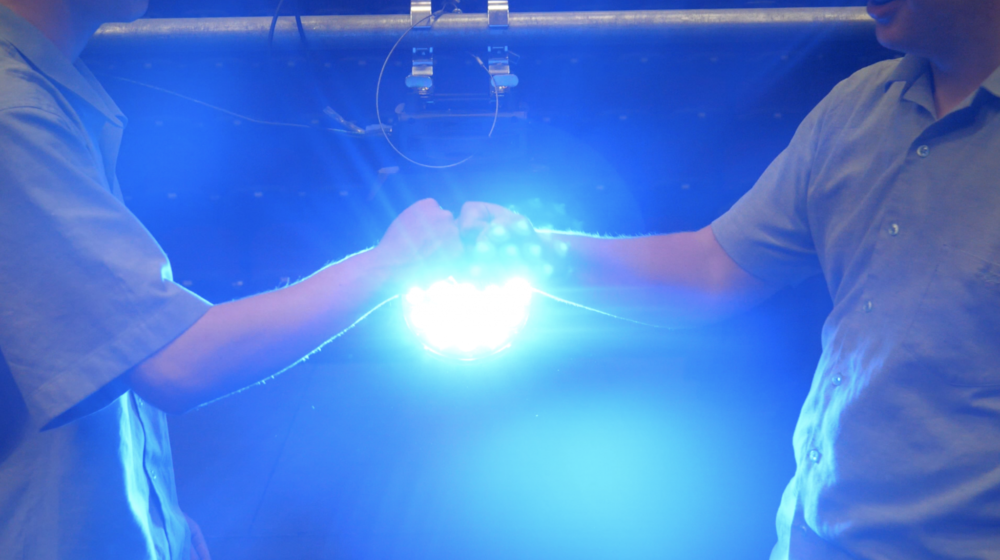

-   [Curriculum & Subjects](https://www.middleton.school.nz/curriculum-subjects/)
-   [Course Selection](https://www.middleton.school.nz/course-selection/)
-   [Careers Department](https://www.middleton.school.nz/careers-department/)
-   [Leadership](https://www.middleton.school.nz/leadership/)
-   [Service](https://www.middleton.school.nz/service/)
-   [Remote Learning](https://www.middleton.school.nz/remote-learning/)
-   [NCEA Information](https://www.middleton.school.nz/ncea-information/)
-   [Learning Support](https://www.middleton.school.nz/learning-support/)
-   [Fostering Strengths](https://www.middleton.school.nz/fostering-strengths/)
-   [Pastoral Care](https://www.middleton.school.nz/pastoral-care/)
-   [BYOD](https://www.middleton.school.nz/byod/)
-   [Library Dashboard](https://aiscloud.nz/MDD00/#!landingPage)
-   [Overseas Trips](https://www.middleton.school.nz/overseas-trips/)
-   [Sport](https://www.sporty.co.nz/middleton)
-   [Performing Arts](https://www.middleton.school.nz/performing-arts/)

## MGS Performing Arts

## TECH & MEDIA

[Y7-8 Workshops](#tech78)

[Y9-13 Tech Crew](#tech913)

Ask not what your tech crew can do for you, but what you can do for your tech crew!

**Vision for the MGS Tech Crew**

We work to provide a live technology, and media programme of the highest quality, allowing MGS students to serve the wider school community through Audio/Visual technology. We provide technicians with the opportunity to express their gifts and talents while supporting the gifts and talents of the people they serve. We work to capture and celebrate the works and achievements of the school community for the glory of God.

## Y9-13 Tech Crew

### What we do

-   Regular maintenance of the theatre technologies
-   Sound, Lighting and A/V support for most school events
-   Creative use of technology for performing arts events
-   Filming and Editing of school events
-   Videos to support the school community

### You will grow in

-   Confidence & Discipline
-   Knowledge of technology
-   Communication & Teamwork
-   Professional skills
-   Technical skills

### Opportunities include

-   School Production
-   Performing Arts Events incl. Curriculum events – Rock Night, Cafe Acoustique, Drama Assessments
-   Filming and Editing
-   48Hours Film Festival
-   Supporting School Assemblies

**Tech Crew is run by Mr Joel Tempero**

[Email Mr Tempero](mailto:j.tempero@middleton.school.nz)

## Y7-8 Tech Workshops

## After School Program

#### The Y7-8 Tech Workshops are dedicated opportunities for our students to come to the theatre and learn the fundamentals of theatre technology.

## Workshop Calendar

\*Dates subject to change based on group numbers and scheduling conflicts. Confirmation of dates will go out once the group has been formed.

**Term 2**

 

13th May

Health & Saftey

3rd June

Microphones

25th June

Mary Poppins

**Term 3**

 

23rd July

Studio A

5th August

Sound Mixing

26th August

Lighting

**Term 4**

 

21st October

Communication

4th November

Cameras

18th November

Light A Scene

[Email Mr Tempero](mailto:j.tempero@middleton.school.nz)
