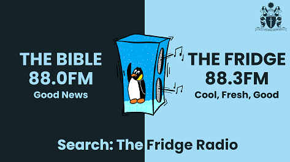

-   [Curriculum & Subjects](https://www.middleton.school.nz/curriculum-subjects/)
-   [Course Selection](https://www.middleton.school.nz/course-selection/)
-   [Careers Department](https://www.middleton.school.nz/careers-department/)
-   [Leadership](https://www.middleton.school.nz/leadership/)
-   [Service](https://www.middleton.school.nz/service/)
-   [Remote Learning](https://www.middleton.school.nz/remote-learning/)
-   [NCEA Information](https://www.middleton.school.nz/ncea-information/)
-   [Learning Support](https://www.middleton.school.nz/learning-support/)
-   [Fostering Strengths](https://www.middleton.school.nz/fostering-strengths/)
-   [Pastoral Care](https://www.middleton.school.nz/pastoral-care/)
-   [BYOD](https://www.middleton.school.nz/byod/)
-   [Library Dashboard](https://aiscloud.nz/MDD00/#!landingPage)
-   [Overseas Trips](https://www.middleton.school.nz/overseas-trips/)
-   [Sport](https://www.sporty.co.nz/middleton)
-   [Performing Arts](https://www.middleton.school.nz/performing-arts/)

## MGS Performing Arts

## RADIO

"TV gives everyone an image, but radio gives birth to a million images in a million brains."

Peggy Noonan

"Radio affects most intimately, person-to-person, offering a world of unspoken communication between writer-speaker and the listener."

Marshall McLuhan

"I prefer radio to TV because the pictures are better."

Alistair Cooke, BBC

A Fridge is cool, and keeps things fresh and good – like Middleton’s radio station, The Fridge.

Inspired by Philippians 4:8, The Fridge aims to play things that are true, noble, right, pure, lovely, admirable, excellent and praiseworthy.  We’ve been on air for seven years.

The Fridge broadcasts on FM in eight towns and cities around New Zealand, playing a mix of Christian and uplifting secular music, with news, interviews, Scripture, prayer, teaching, and no ads.  There are currently 80 students hosting shows on air, and you can hear The Fridge 24/7 in Christchurch on 88.3FM as well as online: [www.thefridge.net.nz](http://www.thefridge.net.nz) 

Middleton’s second radio station is The Bible FM, on air in five towns and cities including Christchurch 88.0FM.  Listeners can hear the entire New Testament read by our students.  

We’re grateful for professional equipment and the support of the broadcasting industry and many churches and organisations.  

### What we do

-   Broadcast live on air
-   Create recorded content
-   Interview pastors, youth leaders, ministry groups and organisations

### You will grow in

-   Confidence with public speaking
-   Discernment of what is uplifting and helpful for others
-   Technical Skills

### Opportunities include

-   Regular shows before and after school and during interval and lunchtimes 
-   Special events such as Athletics Days and the 40 Hour Challenge
-   Recording prayers, Scripture and announcements
-   Outside broadcasts at other schools, churches and community events 

**The Radio Team is run by Mr Warren Judkins**

## Y7-13

[Email Mr Judkins](mailto:w.judkins@middleton.school.nz)

## Listen Live: The Fridge

[https://s2.stationplaylist.com:7078/listen.mp3](https://s2.stationplaylist.com:7078/listen.mp3)

## Listen Live: The Bible

[https://s2.stationplaylist.com:7078/thebible.mp3](https://s2.stationplaylist.com:7078/thebible.mp3)

The Fridge:  
88.3FM Hamilton  
88.3FM Christchurch  
88.3FM Ashburton  
87.8FM Oamaru  
88.3FM Wanaka  
88.3FM Queenstown  
88.3FM Gore  
87.8FM Invercargill

The Bible:  
88.0FM Christchurch  
88.0FM Ashburton  
87.6FM Oamaru  
87.8FM Wanaka  
88.0FM Queenstown  
88.0FM Gore  
106.7FM Invercargill

Online: [thefridge.net.nz](http://thefridge.net.nz)  
Email: [thefridge@middleton.school.nz](mailto:thefridge@middleton.school.nz)  
Phone: [0800 THE FRIDGE](tel:0800843374343)

**Murray Robertson 7am and 7pm daily.**

**The Chill Zone 10pm-6am nightly.**

**The Healthy Breakfast 7 – 9am weekdays.**
