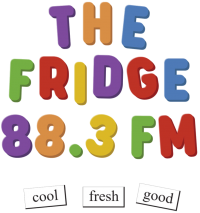

## THE BIBLE  
88.0FM

### Good News

[https://s2.stationplaylist.com:7078/thebible.mp3](https://s2.stationplaylist.com:7078/thebible.mp3)

## THE FRIDGE  
88.3FM

### Cool, Fresh, Good

[https://s2.stationplaylist.com:7078/listen.mp3](https://s2.stationplaylist.com:7078/listen.mp3)

## The Freezer

[https://s2.stationplaylist.com:7078/thefreezer.mp3](https://s2.stationplaylist.com:7078/thefreezer.mp3)

## The Fridge

88.3FM Hamilton  
88.3FM Christchurch  
88.3FM Sumner  
107.5FM West Melton  
88.3FM Ashburton  
87.8FM Oamaru  
88.3FM Wanaka  
88.3FM Queenstown  
88.3FM Gore  
87.8FM Invercargill

## The Bible

88.0FM Christchurch  
87.6FM Ashburton  
87.6FM Oamaru  
87.8FM Wanaka  
87.6FM Queenstown  
88.0FM Gore  
106.7FM Invercargill

Check us out on Instagram and Spotify

[Instagram](https://instagram.com/thefridgeradio?igshid=MzNlNGNkZWQ4Mg) [Spotify](https://open.spotify.com/user/31ppeg3sg4z6ygyhwve7v3wi4mjq)

## Thanks to Rhema Media!

[https://rhemamedia.co.nz/home](https://rhemamedia.co.nz/home)

# Cool, Fresh and Good

“The Fridge” is so named because it’s cool, fresh and keeps things good. We aim to build faith, speak truth and bring joy. Sixty students are on air during school days and the show keeps rolling 24/7.

You’ll find Scripture, clean classics and Christian hits to build faith, speak truth and bring joy. News each hour and quiet vibes to chill to overnight, plus Bible teaching at 7am and 7pm. And no ads.

-   Murray Robertson 7am and 7pm daily
-   The Chill Zone 10pm-6am nightly
-   The Healthy Breakfast 7 – 9am
-   News on the hour 6am – 8pm

[Read more about the Fridge](https://www.middleton.school.nz/thefridge/#about)

# Murray's Messages

Search for Murray Robertson’s messages here: [https://murraysmessages.co.nz/](https://murraysmessages.co.nz/)

[Or find him on Spotify here](https://open.spotify.com/show/44EKqQgUU8YjKMM9JtR3e1?si=4fff4ac1f8254ca9)

# Contact the Fridge

Want to get involved? Have a song suggestion? Get in touch.

   

Name 

Email address 

Message

You can attach audio files here 

Record a shout-out, interview, story or verse and send it here. Audio files only please.

Send

# Student Christian Radio

“The Fridge” is so named because it’s cool, fresh and keeps things good. We aim to build faith, speak truth and bring joy. Sixty students are on air during school days and the show keeps rolling 24/7.

You’ll find Scripture, clean classics and Christian hits to build faith, speak truth and bring joy. News each hour and quiet vibes to chill to overnight, plus Bible teaching at 7am and 7pm. And no ads.

You’ll find The Fridge in your car on 88.3FM in many towns and cities (see above), and you can listen online anywhere from this web page – search “the fridge radio.”

You’ll also find recording there of students reading the Bible.

Apart from the fun which the students have, The Fridge gives them the opportunity to be discerning in their choice of music and what they say. We run everything past Philippians 4:8, whatever is true, noble, right, pure, lovely, admirable, excellent, praiseworthy – think on these things.

We hope that The Fridge is Middleton’s gift to the wider community. Why not listen, and if you like what you hear, spread the word?

What’s more, your young people can get involved. They can send shout-outs and song requests from our website. Send us recordings they’ve made and we’ll put them to air! If you’re in Canterbury, we can visit your school or youth group with our mobile studio and your students can broadcast live to our network from there. And wherever you are, if you’re willing to host a transmitter and antenna, The Fridge could broadcast on FM permanently from your school or church.

**You can contact us at 0800 THE FRIDGE or [thefridge@middleton.school.nz](mailto:thefridge@middleton.school.nz)**

### The fridge Radio

On air: 88.3FM  
Online: [thefridge.net.nz](http://thefridge.net.nz)  
Email: [thefridge@middleton.school.nz](mailto:thefridge@middleton.school.nz)  
Phone: [0800 THE FRIDGE](tel:0800843374343)

### MIDDLETON GRANGE School

Middleton Grange School  
[https://www.middleton.school.nz/](https://www.middleton.school.nz/)

**Phone:** [+64 (03) 348 9826](tel:+6433489826)  
**Email:** [office@middleton.school.nz](mailto:office@middleton.school.nz)

[Close QUICK LINKS](#)

## Quick Links

## [Parent Portal](https://middleton.school.kiwi/)

## [Student Portal](https://middletonschoolnz.sharepoint.com/teams/home)

## [Calendar](https://www.middleton.school.nz/calendar/)

## [KINDO](https://shop.tgcl.co.nz/shop/q2.shtml?session=false&shop=Middleton%20Grange%20School)

## [School app](http://middletongrange.apps.school.nz/share/)

## [Facebook](https://www.facebook.com/Middletongrangeschool/)

## [Contact us](https://www.middleton.school.nz/contact-us/)

Search 

[+64 (03) 348 9826](tel:+6433489826)  
[office@middleton.school.nz](mailto:office@middleton.school.nz)  
[absences@middleton.school.nz](mailto:absences@middleton.school.nz)

× Close Panel
