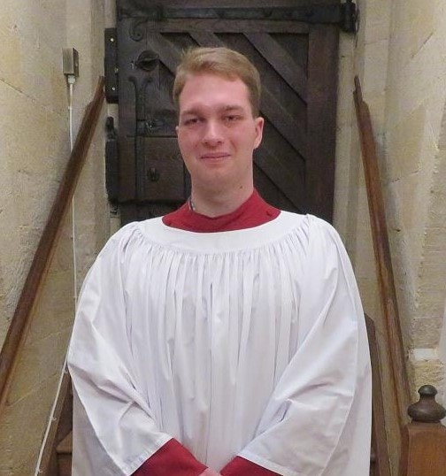

## Alumni Profile

# Timo Niehaumeier

-   Leaving Year: [2021](https://www.middleton.school.nz/tag/2021/)

I started at Middleton Grange School in 2019 as a Year 11, having come from Hillview Christian School. One of the greatest memories from my time at MGS was the opportunity to participate in the Senior College Production *Oliver* as ‘Mr Bumble’in Year 13. I’m also grateful for having been able to sing in the Senior College Choir, Crescendos, and to play the trumpet in the Senior College Orchestra. I have many pleasant memories of all the teachers I had during my three years at the school. I from MGS in 2021.

I have been part of the Christchurch Cathedral Choir at the Anglican Transitional Cathedral since 2014. I began as a boy chorister, singing treble, and now I sing bass in the back row of the choir as a Choral Scholar. In September/October of this year (2022) I had the privilege to represent the New Zealand Christchurch Cathedral Choir in Christ Church, Oxford, in the UK. This 18-day trip was funded by the Canterbury Association OXFORDS PROJECT which has fostered a relationship between the two cathedrals for 25 years. Generally, these trips involved six Lay Clerks (Professional Singers) of Christ Church, Oxford coming to New Zealand for a few weeks. Therefore, I felt extremely honoured to be selected for this trip, as it is one of the first times that singers from Christchurch, New Zealand have visited Oxford.

This year I attended Laidlaw College in Christchurch, studying Theology. I am looking forward to graduating at the end of this year (2022) with a New Zealand Diploma in Christian Studies. I have also had the opportunity to be a small group leader this year at YROC (the youth group at Rutland St. Church) which I have enjoyed immensely. While I am still unsure what the future holds for me, I trust that God will lead me to where He wants me to serve.

[Back to Alumni](https://www.middleton.school.nz/alumni/)

### More Alumni Profiles

### [Stephanie Hunt (née Mathieson)](https://www.middleton.school.nz/stephanie-hunt-nee-mathieson/)

### [Caleb Croker](https://www.middleton.school.nz/caleb-croker/)

### [Ellen Paynter](https://www.middleton.school.nz/ellen-paynter/)

### [Elisha Nuttall](https://www.middleton.school.nz/elisha-nuttall/)

### [Frances Watson](https://www.middleton.school.nz/frances-watson/)

### [Geoff Wallis (Primary Teacher, 2016–2022)](https://www.middleton.school.nz/geoff-wallis-primary-teacher-2016-2022/)

[See all](https://www.middleton.school.nz/alumni-profiles/)
