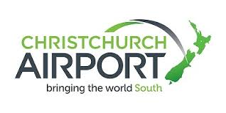

# Useful Links

-   [Welcome](https://www.middleton.school.nz/international/)
-   [International Contact](https://www.middleton.school.nz/international-contact/)
-   [International Enrolment](https://www.middleton.school.nz/international-enrolment/)
-   [Residential Care Accommodation](https://www.middleton.school.nz/homestays/)
-   [NCEA & Subjects](https://www.middleton.school.nz/ncea/)
-   [ESOL Programmes](https://www.middleton.school.nz/esol-programmes/)
-   [University Pathways](https://www.middleton.school.nz/university-pathways/)
-   [Student Stories](https://www.middleton.school.nz/student-stories/)
-   [Our Photos](https://www.middleton.school.nz/international-photos/)
-   [Our Videos](https://www.middleton.school.nz/international-videos/)
-   [Useful Links](https://www.middleton.school.nz/useful-links/)
-   [International Board](https://www.middleton.school.nz/international-board/)
-   [International College Staff](https://www.middleton.school.nz/international-college-staff/)
-   [ERO Review](https://ero.govt.nz/institution/335/middleton-grange-school)
-   [Agents](https://www.middleton.school.nz/agents/)

Click the images to find useful information about our beautiful country, New Zealand, our city of Christchurch, known as the Garden City, and our International Education Partners.

[**Find us on Facebook**](https://www.facebook.com/middletoninternational/)

**Christchurch NZ  
*Get info [here](https://www.christchurchnz.com/live/studying-here) to discover more about living and studying in Christchurch***

[**Education New Zealand**](https://enz.govt.nz/)

[**New Zealand Immigration Service**](https://www.immigration.govt.nz/)

[**Why live in Christchurch?**](https://www.christchurchnz.com/)

[**Christchurch Airport**](https://www.christchurchairport.co.nz/)

[**New Zealand Qualifications Authority**](https://www.nzqa.govt.nz/)

[**University of Canterbury International College**](https://www.ucic.ac.nz/)

[**University of Canterbury Scholarships**](https://www.canterbury.ac.nz/get-started/scholarships/?gclid=CjwKCAjwqJ_1BRBZEiwAv73uwLamHC8BD9EjvGmhtw1RcEJqpbzkDbOVOKzQCbXoAuuDY50zTMJGExoCvdIQAvD_BwE)

[**Lincoln University**](https://www.lincoln.ac.nz/)

[**Mental Health Resources & Information**](https://mherc.org.nz/)

[**NZ Police**](https://www.police.govt.nz/)
