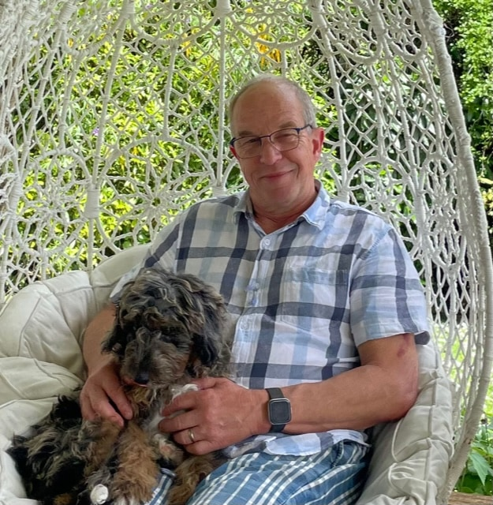

## Alumni Profile

# Willem Bouman

-   Leaving Year: [1969](https://www.middleton.school.nz/tag/1969/)

I was born in Darfield Hospital of immigrant parents, who arrived on New Zealand’s fair shores in 1951 from Indonesia (known at the time as the Dutch East Indies) to a farming community in Hororata.

When my parents and I moved to Christchurch some years later, I attended several schools before commencing at Middleton Grange as a first day pupil in 1964. One could say I had a bit of unique view of the school both in class and out of the classroom setting, as my father (Dick Bouman) was the caretaker/groundsman at Middleton Grange from its inception. Consequently, we lived in ‘The Old House’ on the schoolgrounds for many years. My bedroom, overlooking the grounds and the famous ‘holy dip’, was the very room in which Captain Robert Falcon Scott and Sir Ernest Shackleton stayed prior to their 1901 Antarctic expedition, during which time they needed to calibrate their navigational instruments at the Magnetic Observatory in the Christchurch Botanic gardens before departing to the pole.

My school years were ‘eventful’ in both academic and sporting achievements, though I hasten to add the latter being the more enjoyable, being part of the first XV cricket and hockey team. A memorable trip down south with the cricket team in the school VW combi curtailed by a crash at a Templeton intersection, when a car failed to give way, and the 3 of us in the front seat (Mr Hawkins driving) ending up with stitched up faces (19 stiches on my cheek, an impressive scar for many years) and no cricket that day! I also recall the said Mr Hawkins being very excited some time later when a large box of laboratory equipment, supplied by the government, arrived for the Science department, ‘a gift from God’.

After leaving school in 1969, I commenced an engineering apprenticeship as Tool & Die maker with advanced trade certificates. I worked at several companies over the years, gaining experience in both steel and plastics manufacturing and precision engineering. In 1994, I took a leap of faith to start my own business. They were challenging and rewarding times. Over the years we grew from 1 to 18 staff, also bringing in our son, who eventually became a business partner. We added to the business a bespoke wheelchair manufacturing company a few years ago, catering to mainly ACC clients with traumatic injury, providing mobility and seating arrangements. I recently retired as Company Director, leaving the business(es) in the capable hands, of our youngest son Michael, who, has been holding the reigns for a while now, and trust and pray God will continue to bless this work through him and the teams he manages.

In 1975, I married the love of my life, and we were, over the years, blessed with three fine children, who also attended, and had a successful education at Middleton Grange. We are excited to see one of our grandchildren continuing the family connection with the school having recently started in middle school. We have throughout the years found the school’s teachings and principals to be complementary to our own Christian faith and are thankful for the richness this has brought in our lives.

In the vicissitudes of life, I have been thankful for Christian upbringing and schooling, the roles I/we have been privileged to be engaged in, in church and other organisations, family and friends on our path with whom to walk and commune with, all the while knowing God’s ever nurturing and sustaining presence in and throughout our lives.

[Back to Alumni](https://www.middleton.school.nz/alumni/)

### More Alumni Profiles

### [Stephanie Hunt (née Mathieson)](https://www.middleton.school.nz/stephanie-hunt-nee-mathieson/)

### [Caleb Croker](https://www.middleton.school.nz/caleb-croker/)

### [Ellen Paynter](https://www.middleton.school.nz/ellen-paynter/)

### [Elisha Nuttall](https://www.middleton.school.nz/elisha-nuttall/)

### [Frances Watson](https://www.middleton.school.nz/frances-watson/)

### [Geoff Wallis (Primary Teacher, 2016–2022)](https://www.middleton.school.nz/geoff-wallis-primary-teacher-2016-2022/)

[See all](https://www.middleton.school.nz/alumni-profiles/)
