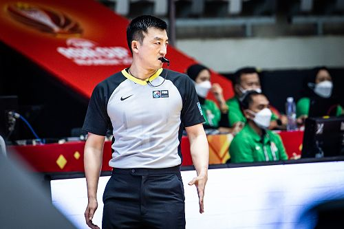

## Alumni Profile

# Xiao Zhang

-   Leaving Year: [2005](https://www.middleton.school.nz/tag/2005/)

#### **My journey so far…**

My name is Xiao Zhang, you pronounce the “X” as “Sh~~” if the Chinese students have not taught you about it since I left Middleton in 2005. To me personally, coming to Middleton was a totally God’s arrangement, when I got rejected by the other independent school in town(yes, the one that has navy uniforms), that was where I started a rather short journey with Middleton Grange School, but has impacted my life since then. In my 1st year, I found my passion, the sport of Basketball was a quite big thing at Middleton, Gators were and still are a big thing. Then I started to live with the Harrison’s family, which seems to make sense if you want to be involved with Basketball, at all times. After graduation, I moved to Canada to start my undergraduate studies. First, I was at the University of Windsor in Ontario, then I moved to Vancouver, finishing my Bachelor in General Studies with two minors in Education and Asia-Canada Studies in 2012, with Simon Fraser University. I was going back to China every summer during my college years. During my time there, I found another path to continue my love of basketball, but through a different role: Officiating, which originated with Faith putting me in the Elementary games, Middleton prepares you for all situations. I started doing Referee in the Chinese National tournaments in 2010, that’s also the year I first met my stunning future wife in Canada. I qualified for my National-Level Referee in 2012, in the same year, I got accepted by Beijing Sports University for graduate school, with a major in Sports Management. I passed my FIBA license in 2015, and from then, I started doing referee as my part-time job but takes almost full-time. I have been doing the CBA and WCBA(senior men’s & women’s league) in China since 2013, a few FIBA Asia Cup games, NBA summer league tournaments, and attended my first FIBA world tournament in Italy in 2017, the FIBA U19 Women’s Basketball World Cup. Also worth mentioning was the 30th Summer Universiade game, the 2020 Women’s Olympic Qualifying tournament in France, as well as the FIBA 2023 World Cup Qualifier Game back to Auckland in this past August. As you can see, basketball has taken me to places, but what has helped me with all those opportunities were the values I received at Middleton Grange, to Love people, to be kind, and to help others with the best you could. That was what a 17-year-old teenager received at Middleton, up until today, a man with a beautiful wife and a beautiful 6-year-old daughter. Ups and downs, the values and teachings have been blessing me every day. The journey goes on…

[Back to Alumni](https://www.middleton.school.nz/alumni/)

### More Alumni Profiles

### [Stephanie Hunt (née Mathieson)](https://www.middleton.school.nz/stephanie-hunt-nee-mathieson/)

### [Caleb Croker](https://www.middleton.school.nz/caleb-croker/)

### [Ellen Paynter](https://www.middleton.school.nz/ellen-paynter/)

### [Elisha Nuttall](https://www.middleton.school.nz/elisha-nuttall/)

### [Frances Watson](https://www.middleton.school.nz/frances-watson/)

### [Geoff Wallis (Primary Teacher, 2016–2022)](https://www.middleton.school.nz/geoff-wallis-primary-teacher-2016-2022/)

[See all](https://www.middleton.school.nz/alumni-profiles/)
