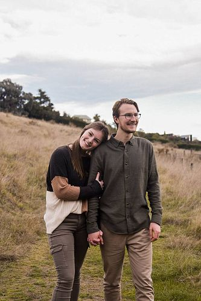

## Alumni Profile

# Zinan Bennett

-   Leaving Year: [2019](https://www.middleton.school.nz/tag/2019/)

I served as head boy and graduated Middleton in 2019. From year 11 I knew that I wanted to learn how to teach. I love learning and especially being taught things and journeying with people in that process. However, upon graduating from Middleton I had a very strong desire to visit the USA and experience the school system over there. I knew this was from the Lord and He graciously supplied me with the finances and means to get there! So at the beginning of January 2020, I departed for Montana USA for 6 months. I stayed with the family of a girl named Zephanhia Linton who had previously been an exchange student at Middleton in 2018. Unbeknownst to me, due to a certain event that began in 2020, I was only able to attend about 2 months of that time actually in the school. Yet this was a blessing in itself as this time gave me such a wonderful opportunity to really connect with Zephanhia and her family. This turned out to be such a gift from God as Zephanhia and I are now engaged and are preparing for a lifetime together from June of 2023. Due to the distance between us, the last two years have been challenging as Zephanhia has been studying in Montana while I moved back to New Zealand. In 2021 I began my journey toward secondary school teaching at Canterbury University (I am currently two years into a science degree). The more I am exposed to teaching opportunities and examples, the more excited (and nervous) I am to be there myself. I will always remember and appreciate everything I have been given from Middleton. I have especially enjoyed being able to continue to catch up with and learn from staff such as Mrs. Gomez, Mr. Vannoort (jr), Mr. McConnell, and Mrs. Vellupillai. I am very much looking forward to marriage this year and walking further into whatever wonderful opportunities God has planned next. I would love to encourage everyone in whatever challenge they face next – as long as it is with God and for His glory who can stop you (Matt 19:26).

[Back to Alumni](https://www.middleton.school.nz/alumni/)

### More Alumni Profiles

### [Stephanie Hunt (née Mathieson)](https://www.middleton.school.nz/stephanie-hunt-nee-mathieson/)

### [Caleb Croker](https://www.middleton.school.nz/caleb-croker/)

### [Ellen Paynter](https://www.middleton.school.nz/ellen-paynter/)

### [Elisha Nuttall](https://www.middleton.school.nz/elisha-nuttall/)

### [Frances Watson](https://www.middleton.school.nz/frances-watson/)

### [Geoff Wallis (Primary Teacher, 2016–2022)](https://www.middleton.school.nz/geoff-wallis-primary-teacher-2016-2022/)

[See all](https://www.middleton.school.nz/alumni-profiles/)
